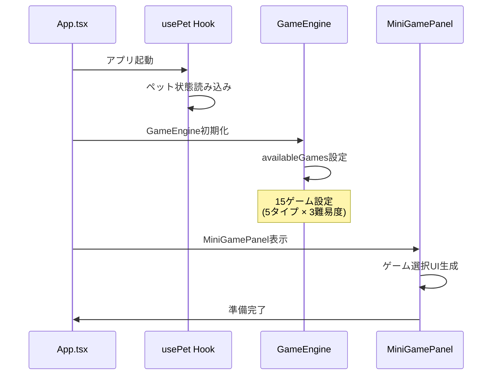
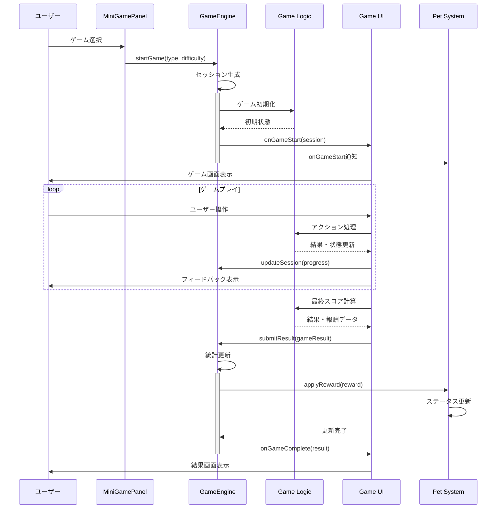
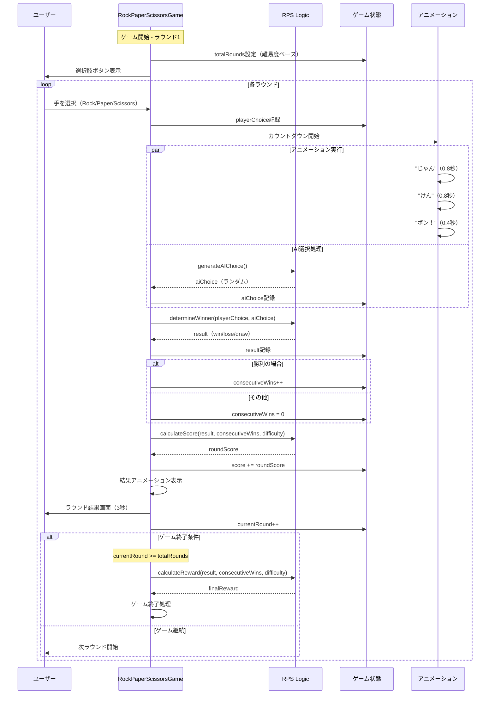
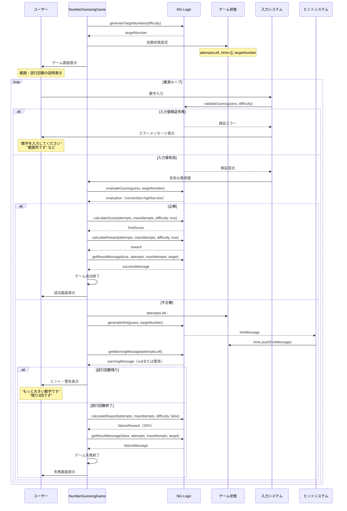
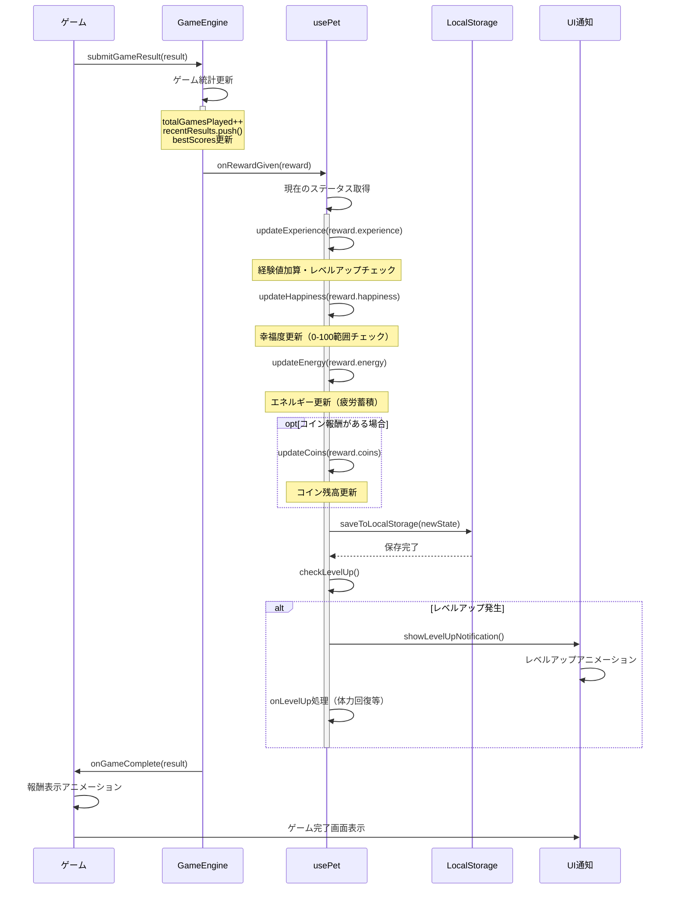
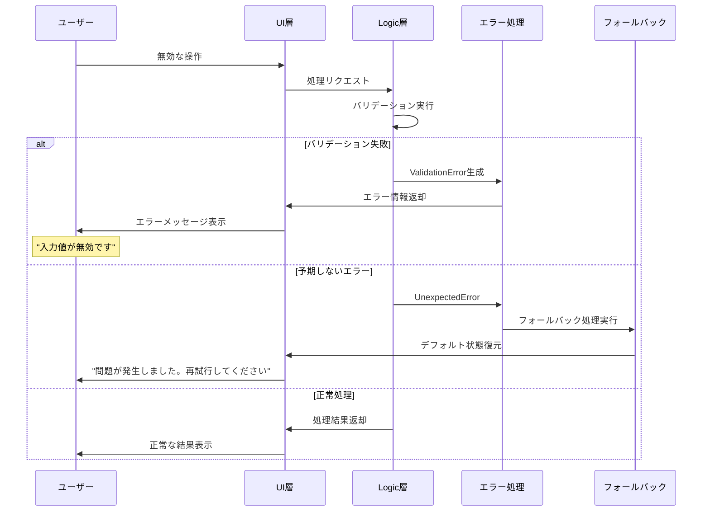
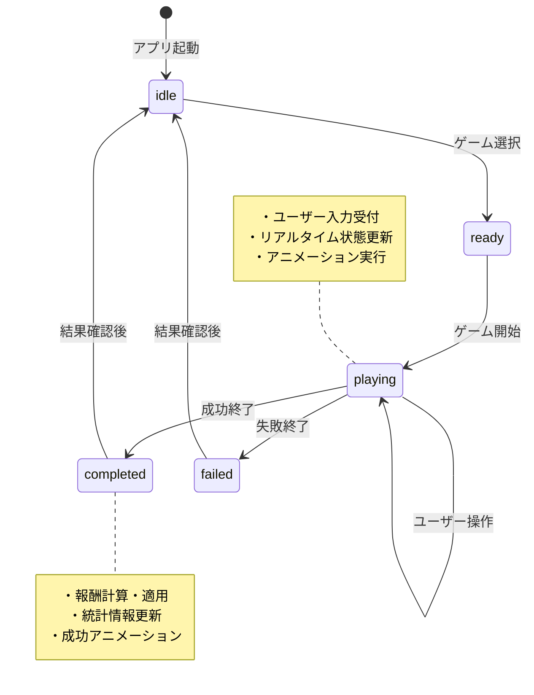
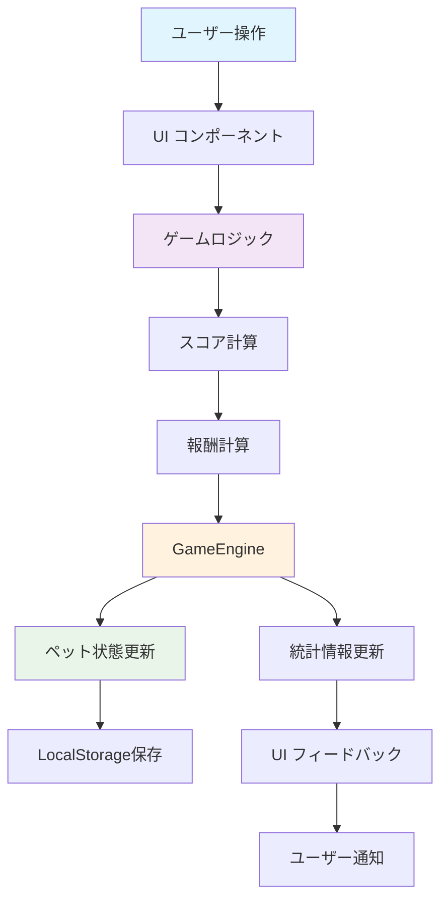

# ミニゲーム シーケンス図詳細版

## 🎯 概要
このドキュメントは、AI Pet Buddy アプリのミニゲーム機能における詳細な処理フローをシーケンス図で示しています。

## 📋 システム全体フロー

### 1. アプリケーション初期化とゲーム準備

### 2. 統合ゲーム開始・終了フロー

## 🎮 ゲーム固有フロー

### 3. じゃんけんゲーム - 詳細処理フロー

### 4. 数当てゲーム - 詳細処理フロー

### 5. 報酬適用とペット状態更新フロー

### 6. エラーハンドリングフロー

## 🔄 状態管理フロー

### 7. ゲーム状態ライフサイクル

### 8. データフロー概要

---

## 🛠️ 技術実装ポイント

### パフォーマンス最適化
- **React.memo**: 不要な再レンダリング防止
- **useCallback**: イベントハンドラー最適化
- **状態の最小化**: 必要最小限のstate管理

### エラー境界
- **Error Boundary**: コンポーネントレベルでのエラー捕捉
- **Fallback UI**: エラー時の代替表示
- **ログ収集**: エラー情報の記録・分析

### アクセシビリティ
- **ARIA属性**: スクリーンリーダー対応
- **キーボード操作**: マウス不要の操作体系
- **フォーカス管理**: 適切なタブオーダー

---

**📚 関連ドキュメント**
- [メイン技術仕様書](./MINI-GAMES-DOCUMENTATION.md)
- [テスト戦略](./TESTING-STRATEGY.md)
- [開発ガイドライン](./PHASE-4-IMPLEMENTATION-GUIDE.md)