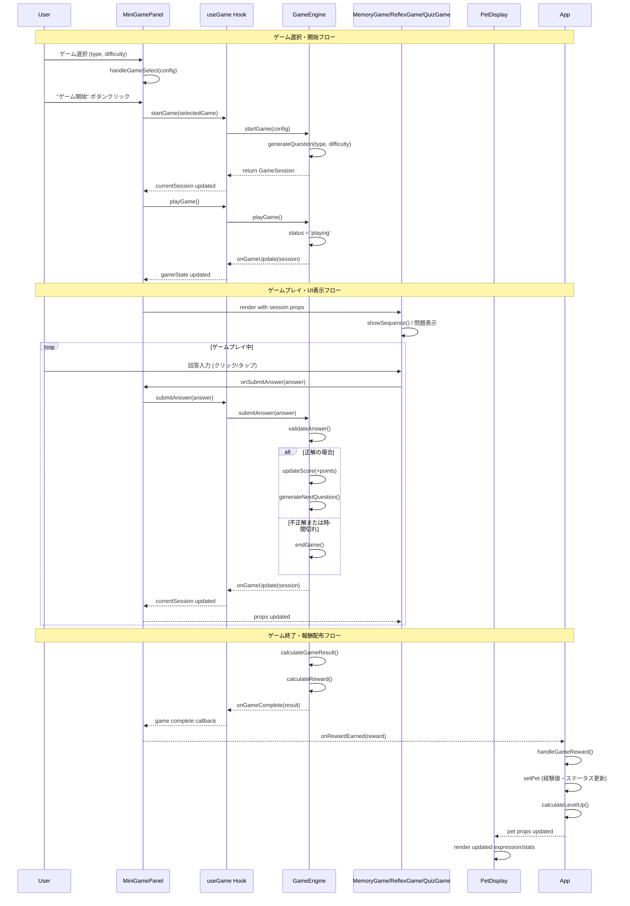
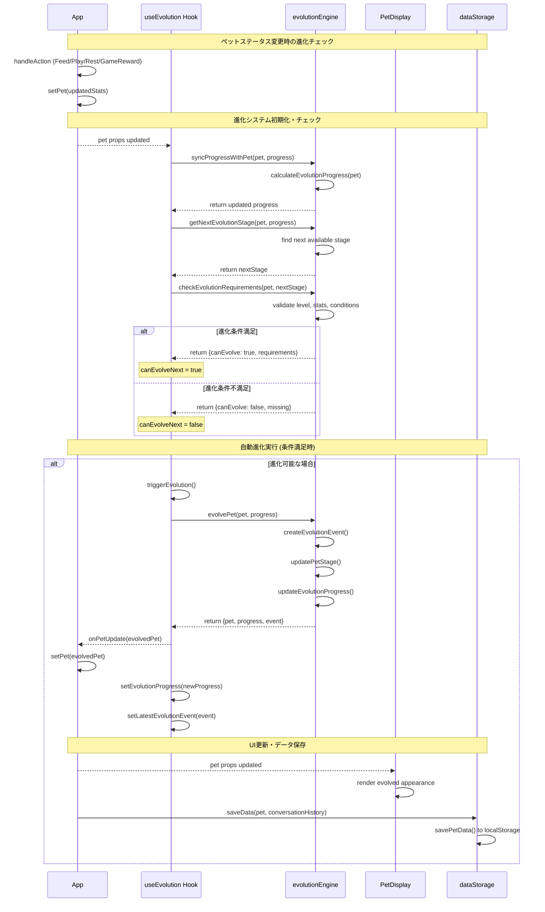
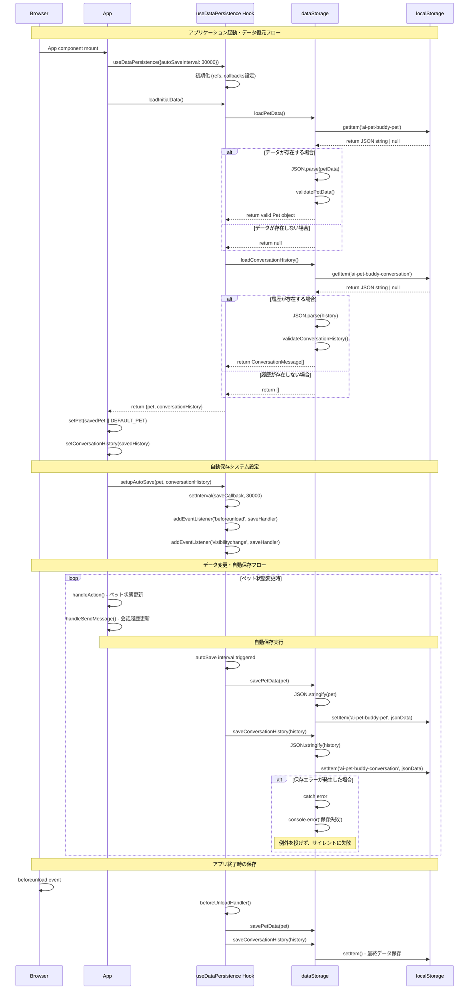
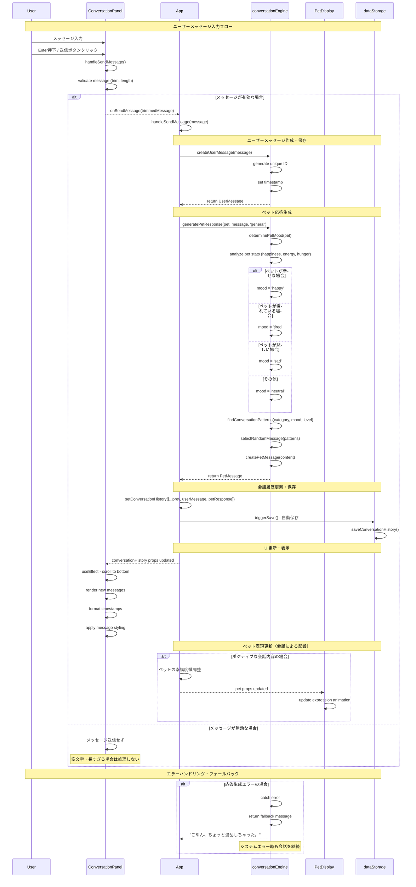
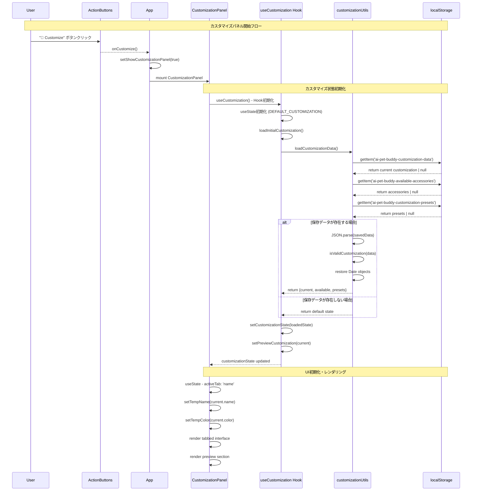
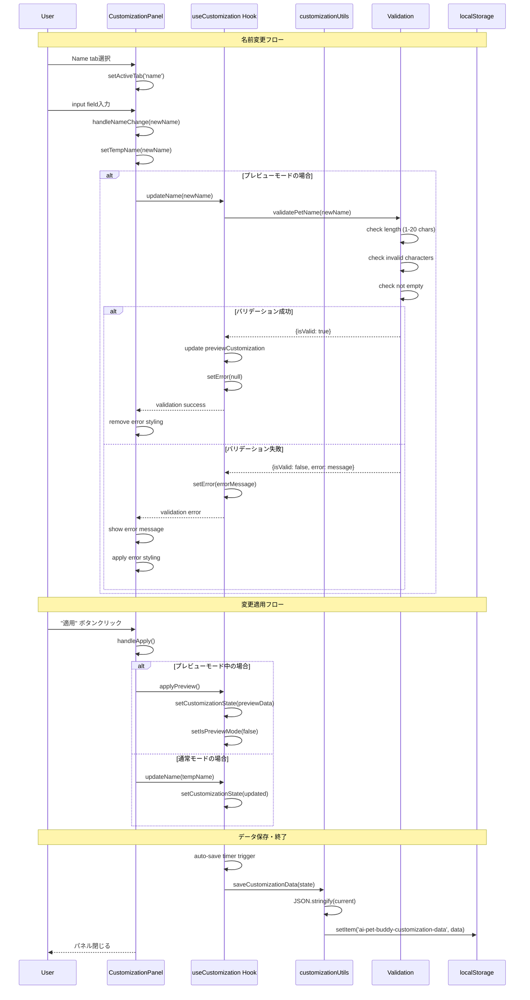
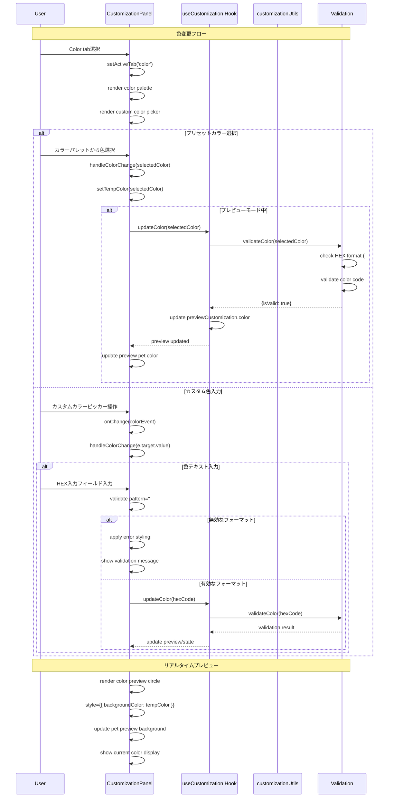
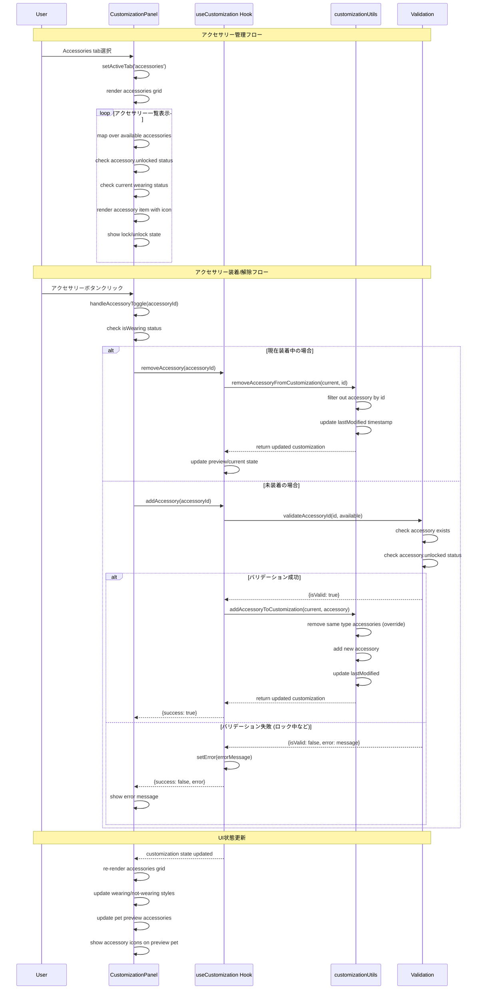
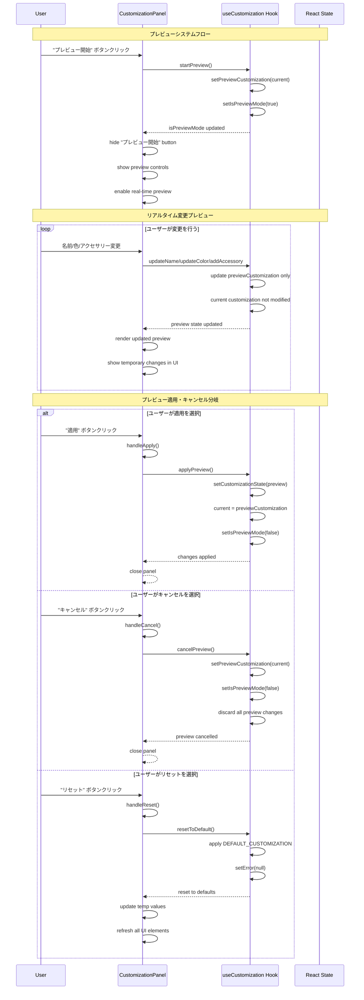
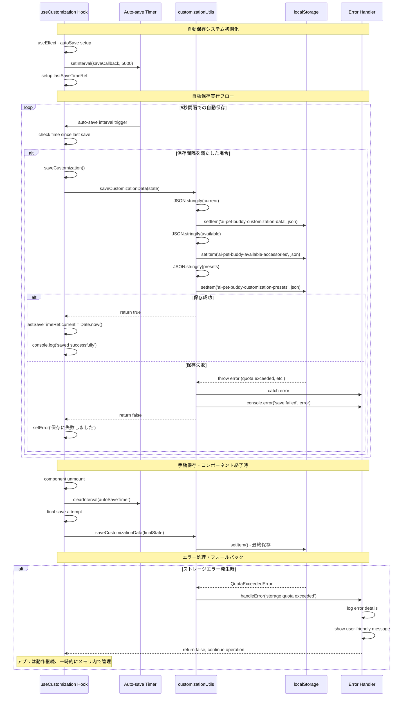

# AI Pet Buddy システムフロー シーケンス図

このドキュメントでは、AI Pet Buddyプロジェクトの主要な処理フローをシーケンス図で視覚化しています。各図はMermaid記法で記述されており、システムの動作を理解しやすくすることを目的としています。

## 1. ミニゲーム実行フロー

ユーザーがミニゲーム（Memory Game / Reflex Game / Quiz Game）を実行する際の処理フローです。



### ミニゲーム実行フローの説明

1. **ゲーム選択**: ユーザーがゲームタイプと難易度を選択
2. **セッション開始**: GameEngineが問題を生成し、ゲームセッションを作成
3. **ゲームプレイ**: 各ゲームコンポーネントが問題を表示し、ユーザーの回答を処理
4. **回答検証**: GameEngineが回答を検証し、スコアを更新
5. **報酬配布**: ゲーム終了時に獲得した報酬をペットステータスに反映
6. **UI更新**: PetDisplayがペットの新しい状態を表示

---

## 2. 進化システムフロー

ペットの進化判定・実行フローです。ステータス変更時に自動的に進化条件をチェックし、必要に応じて進化を実行します。



### 進化システムフローの説明

1. **トリガー**: ペットのステータス変更（餌やり、遊び、ゲーム報酬など）
2. **進化判定**: useEvolutionが現在の進化段階と次の段階を計算
3. **条件チェック**: evolutionEngineが進化要件（レベル、ステータス）を確認
4. **進化実行**: 条件満足時に自動的に進化処理を実行
5. **状態更新**: ペットの見た目・能力・進化履歴を更新
6. **永続化**: 変更されたデータをlocalStorageに保存

---

## 3. データ永続化フロー

アプリケーション起動時のデータ復元と、ペット状態変更時の自動保存フローです。



### データ永続化フローの説明

1. **初期ロード**: アプリ起動時にlocalStorageから保存されたデータを復元
2. **データ検証**: 読み込んだデータの整合性をチェック
3. **自動保存設定**: 30秒間隔での自動保存とブラウザ終了時保存を設定
4. **リアルタイム保存**: ペット状態や会話履歴の変更を検知して自動保存
5. **エラーハンドリング**: 保存失敗時もアプリケーションを継続動作

---

## 4. 会話システムフロー

ペットとの会話・応答システムのフローです。ユーザーの入力に基づいてペットが適切な応答を生成します。



### 会話システムフローの説明

1. **入力検証**: ユーザーの入力メッセージを検証（空文字・長さチェック）
2. **メッセージ作成**: タイムスタンプ付きのユーザーメッセージを生成
3. **ペット状態分析**: 現在のペットの気分・ステータスを分析
4. **応答生成**: ペットの状態に応じた適切な応答パターンを選択
5. **履歴更新**: 会話履歴にメッセージを追加し、自動保存
6. **UI反映**: 新しいメッセージを画面に表示し、自動スクロール

---

## 技術的特徴・設計原則

### アーキテクチャの特徴

1. **モジュラー設計**: 各機能を独立したモジュールとして実装
2. **型安全性**: TypeScriptによる完全な型定義
3. **エラーハンドリング**: 各レイヤーでの適切なエラー処理
4. **状態管理**: React Hooksによる効率的な状態管理

### パフォーマンス最適化

1. **メモ化**: useCallbackによる関数の最適化
2. **自動保存**: 適切な間隔での非同期保存
3. **UI更新**: 必要最小限のレンダリング
4. **データ検証**: 保存・読み込み時のデータ整合性確保

### 拡張性・保守性

1. **依存性注入**: コールバックによる疎結合設計
2. **設定可能**: 各システムのパラメータを外部から制御可能
3. **テスト容易性**: 255のテストケースで動作を保証
4. **ドキュメント化**: 明確なインターフェース定義

---

## 5. ペットカスタマイズシステムフロー

Phase 4で実装されたペットカスタマイズシステムの処理フローです。名前変更、色変更、アクセサリー管理の各機能を含みます。

### 5.1 カスタマイズパネル開始・初期化フロー



### 5.2 名前変更フロー



### 5.3 色変更・カラーパレットフロー



### 5.4 アクセサリー管理フロー



### 5.5 プレビューシステムフロー



### 5.6 カスタマイズデータ永続化フロー



---

## 6. カスタマイズシステム技術詳細

### 6.1 アーキテクチャ設計原則

**レイヤー構造**:
```
UI Layer (CustomizationPanel.tsx)
    ↓
Hook Layer (useCustomization.ts)
    ↓
Business Logic Layer (customizationUtils.ts)
    ↓
Type Safety Layer (Customization.ts)
    ↓
Storage Layer (localStorage)
```

**設計パターン**:
1. **Custom Hook Pattern**: ロジックとUIの分離
2. **Preview Pattern**: 変更前の試行機能
3. **Validation Strategy**: 複数バリデーションの統一管理
4. **Auto-save Pattern**: 非同期データ永続化

### 6.2 バリデーション仕様

**名前バリデーション**:
- 長さ: 1-20文字
- 禁止文字: `<>"/\\|?*`
- 空文字禁止

**色バリデーション**:
- フォーマット: `#RGB` または `#RRGGBB`
- HEX形式: `[A-Fa-f0-9]`のみ許可

**アクセサリーバリデーション**:
- 存在チェック: available配列内に存在
- 解除チェック: `unlocked: true`
- 重複制御: 同タイプは1つまで装着可能

### 6.3 データ構造設計

**PetCustomization Interface**:
```typescript
{
  name: string;           // ペット名
  color: string;          // HEXカラーコード
  accessories: Accessory[]; // 装着アクセサリー配列
  unlocked: boolean;      // カスタマイズ機能解除状態
  lastModified: Date;     // 最終更新時刻
}
```

**Storage Strategy**:
- 3つの独立したlocalStorageキー
- JSON直列化でのデータ保存
- Date型の適切な復元処理
- バックワードコンパチビリティ確保

### 6.4 パフォーマンス最適化

**レンダリング最適化**:
- `useCallback`での関数メモ化
- 必要最小限の状態更新
- 条件分岐による無駄なレンダリング防止

**データ管理最適化**:
- 差分更新によるStorage負荷軽減
- 自動保存間隔の調整可能性
- エラー時のフォールバック処理

### 6.5 拡張性・保守性

**拡張ポイント**:
1. **新しいアクセサリータイプ**: type unionへの追加
2. **追加バリデーション**: 関数型での拡張
3. **新しいプリセット**: presets配列への追加
4. **カスタムカラーパレット**: 設定可能なcolor配列

**テスト戦略**:
- 型定義: 13テスト
- Utils: 26テスト  
- Hook: 25テスト
- UI Component: 28テスト
- **合計: 92テスト** (カスタマイズ関連)

これらのシーケンス図と技術仕様により、AI Pet Buddyのペットカスタマイズシステムの全体像が明確になり、新規開発者の理解促進やシステム拡張時の設計指針として活用できます。
