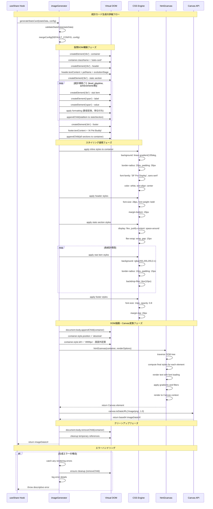

# AI Pet Buddy システムフロー シーケンス図

このドキュメントでは、AI Pet Buddyプロジェクトの主要な処理フローをシーケンス図で視覚化しています。各図はMermaid記法で記述されており、システムの動作を理解しやすくすることを目的としています。

## 1. ミニゲーム実行フロー

ユーザーがミニゲーム（Memory Game / Reflex Game / Quiz Game）を実行する際の処理フローです。

### ミニゲーム実行フローの説明

1. **ゲーム選択**: ユーザーがゲームタイプと難易度を選択
2. **セッション開始**: GameEngineが問題を生成し、ゲームセッションを作成
3. **ゲームプレイ**: 各ゲームコンポーネントが問題を表示し、ユーザーの回答を処理
4. **回答検証**: GameEngineが回答を検証し、スコアを更新
5. **報酬配布**: ゲーム終了時に獲得した報酬をペットステータスに反映
6. **UI更新**: PetDisplayがペットの新しい状態を表示

---

## 2. 進化システムフロー

ペットの進化判定・実行フローです。ステータス変更時に自動的に進化条件をチェックし、必要に応じて進化を実行します。

### 進化システムフローの説明

1. **トリガー**: ペットのステータス変更（餌やり、遊び、ゲーム報酬など）
2. **進化判定**: useEvolutionが現在の進化段階と次の段階を計算
3. **条件チェック**: evolutionEngineが進化要件（レベル、ステータス）を確認
4. **進化実行**: 条件満足時に自動的に進化処理を実行
5. **状態更新**: ペットの見た目・能力・進化履歴を更新
6. **永続化**: 変更されたデータをlocalStorageに保存

---

## 3. データ永続化フロー

アプリケーション起動時のデータ復元と、ペット状態変更時の自動保存フローです。

### データ永続化フローの説明

1. **初期ロード**: アプリ起動時にlocalStorageから保存されたデータを復元
2. **データ検証**: 読み込んだデータの整合性をチェック
3. **自動保存設定**: 30秒間隔での自動保存とブラウザ終了時保存を設定
4. **リアルタイム保存**: ペット状態や会話履歴の変更を検知して自動保存
5. **エラーハンドリング**: 保存失敗時もアプリケーションを継続動作

---

## 4. 会話システムフロー

ペットとの会話・応答システムのフローです。ユーザーの入力に基づいてペットが適切な応答を生成します。

### 会話システムフローの説明

1. **入力検証**: ユーザーの入力メッセージを検証（空文字・長さチェック）
2. **メッセージ作成**: タイムスタンプ付きのユーザーメッセージを生成
3. **ペット状態分析**: 現在のペットの気分・ステータスを分析
4. **応答生成**: ペットの状態に応じた適切な応答パターンを選択
5. **履歴更新**: 会話履歴にメッセージを追加し、自動保存
6. **UI反映**: 新しいメッセージを画面に表示し、自動スクロール

---

## 技術的特徴・設計原則

### アーキテクチャの特徴

1. **モジュラー設計**: 各機能を独立したモジュールとして実装
2. **型安全性**: TypeScriptによる完全な型定義
3. **エラーハンドリング**: 各レイヤーでの適切なエラー処理
4. **状態管理**: React Hooksによる効率的な状態管理

### パフォーマンス最適化

1. **メモ化**: useCallbackによる関数の最適化
2. **自動保存**: 適切な間隔での非同期保存
3. **UI更新**: 必要最小限のレンダリング
4. **データ検証**: 保存・読み込み時のデータ整合性確保

### 拡張性・保守性

1. **依存性注入**: コールバックによる疎結合設計
2. **設定可能**: 各システムのパラメータを外部から制御可能
3. **テスト容易性**: 255のテストケースで動作を保証
4. **ドキュメント化**: 明確なインターフェース定義

---

## 5. シェア機能フロー

ペットのスクリーンショット撮影、統計カード生成、SNSシェア機能の処理フローです。ユーザーがペットの状態や成長を他のユーザーと共有するための包括的なシステムです。

```mermaid
sequenceDiagram
    participant U as User
    participant AB as ActionButtons
    participant SP as SharePanel
    participant US as useShare Hook
    participant IG as imageGenerator
    participant SU as shareUtils
    participant H2C as html2canvas
    participant SNS as Social Media
    participant Browser as Browser

    Note over U,Browser: シェアパネル起動フロー
    U->>AB: "Share" ボタンクリック
    AB->>AB: handleShareClick()
    AB-->>App: setSharePanelOpen(true)
    App-->>SP: isOpen=true props
    SP->>SP: componentMount & initialization
    SP->>US: useShare() hook initialization
    US->>US: 状態初期化 (isSharing, error, shareHistory)

    Note over U,Browser: スクリーンショット撮影フロー
    U->>SP: "スクリーンショット撮影" ボタンクリック
    SP->>SP: handleCaptureScreenshot()
    SP->>US: captureScreenshot(captureTargetRef.current, options)
    US->>US: setIsSharing(true), clearError()
    
    US->>IG: captureElement(element, options)
    IG->>IG: merge DEFAULT_SCREENSHOT_OPTIONS
    IG->>H2C: html2canvas(element, canvasConfig)
    H2C->>H2C: DOM要素をCanvas描画
    H2C->>H2C: CSSスタイル適用・画像変換
    H2C-->>IG: return Canvas object
    IG->>IG: canvas.toDataURL('image/png', quality)
    IG-->>US: return imageDataUrl (base64)
    
    US->>US: setLastShareImageUrl(imageDataUrl)
    US->>US: setIsSharing(false)
    US-->>SP: return imageDataUrl
    SP->>SP: setShareImageUrl(imageDataUrl)
    SP->>SP: UI更新 - プレビュー画像表示

    Note over U,Browser: 統計カード生成フロー（オプション）
    alt 統計カード生成が選択された場合
        U->>SP: "統計カード生成" ボタンクリック
        SP->>SP: setShareMode('stats')
        SP->>US: generateStatsCard(statsData, config)
        US->>US: setIsSharing(true), clearError()
        
        US->>IG: generateStatsCard(statsData, config)
        IG->>IG: create virtual DOM elements
        IG->>IG: build stats card HTML structure
        IG->>IG: apply CSS styling & layout
        IG->>IG: create temporary container
        IG->>Browser: appendChild(container) - DOM追加
        IG->>H2C: html2canvas(container, options)
        H2C-->>IG: return rendered canvas
        IG->>Browser: removeChild(container) - DOM削除
        IG->>IG: canvas.toDataURL()
        IG-->>US: return statsCardImageUrl
        
        US->>US: setLastShareImageUrl(statsCardImageUrl)
        US-->>SP: return statsCardImageUrl
        SP->>SP: setShareImageUrl(statsCardImageUrl)
    end

    Note over U,Browser: ウォーターマーク追加フロー
    alt ウォーターマーク表示が有効な場合
        SP->>US: addWatermark(shareImageUrl, watermarkConfig)
        US->>IG: addWatermark(imageDataUrl, config)
        IG->>IG: create Image object from dataUrl
        IG->>IG: create Canvas & 2D context
        IG->>IG: drawImage(originalImage)
        IG->>IG: calculate watermark position
        IG->>IG: draw watermark text with styling
        IG->>IG: canvas.toDataURL()
        IG-->>US: return watermarkedImageUrl
        US-->>SP: return watermarkedImageUrl
        SP->>SP: 画像プレビュー更新
    end

    Note over U,Browser: SNSシェア実行フロー
    U->>SP: SNSプラットフォーム選択 (Twitter/Facebook/Instagram/LINE)
    U->>SP: "シェア" ボタンクリック
    SP->>SP: handleSocialShare(platform)
    SP->>US: generateShareData(shareImageUrl, statsData)
    US->>US: createShareData() - title, description, hashtags
    US-->>SP: return ShareData
    
    SP->>US: shareToSocial({platform, shareData})
    US->>US: setIsSharing(true), clearError()
    US->>SU: shareToSocial(options)
    
    SU->>SU: generateShareText(shareData, platform)
    SU->>SU: validateTextLength(text, platform.maxLength)
    SU->>SU: buildShareUrl(platform, shareData)
    alt Twitterの場合
        SU->>SU: URL = "https://twitter.com/intent/tweet"
        SU->>SU: params = {text, hashtags}
    else Facebookの場合
        SU->>SU: URL = "https://www.facebook.com/sharer/sharer.php"
        SU->>SU: params = {u: shareUrl, quote: text}
    else LINEの場合
        SU->>SU: URL = "https://social-plugins.line.me/lineit/share"
        SU->>SU: params = {url: shareUrl, text}
    else Instagramの場合
        Note over SU: WebからのInstagram直接投稿は不可
        SU->>SU: return error message
    end
    
    alt 有効なプラットフォームの場合
        SU->>Browser: window.open(shareUrl, '_blank')
        Browser->>SNS: ブラウザでSNSサイトを開く
        SNS->>SNS: シェア用フォーム表示
        SU-->>US: return {success: true, shareUrl}
    else 無効なプラットフォームの場合
        SU-->>US: return {success: false, error}
    end
    
    Note over U,Browser: シェア履歴管理・保存
    US->>US: createHistoryEntry(platform, content, success)
    US->>US: addToHistory(historyEntry)
    US->>SU: saveShareData(shareData, filename)
    SU->>SU: generateFileName('ai-pet-share')
    SU->>Browser: 画像をlocalStorage/indexedDBに保存（オプション）
    
    US->>US: setIsSharing(false)
    US-->>SP: return ShareResult
    SP->>SP: UI更新 - 成功メッセージ表示

    Note over U,Browser: 画像ダウンロードフロー
    alt ユーザーがダウンロードを選択した場合
        U->>SP: "ダウンロード" ボタンクリック
        SP->>US: downloadImage(shareImageUrl, filename)
        US->>SU: downloadImage(dataUrl, filename)
        SU->>SU: generateFileName('ai-pet-buddy')
        SU->>SU: create downloadable link element
        SU->>Browser: element.href = dataUrl
        SU->>Browser: element.download = filename
        SU->>Browser: element.click() - ダウンロード実行
        SU->>US: addToHistory(downloadEntry)
        Note over Browser: ブラウザのダウンロード処理開始
    end

    Note over U,Browser: エラーハンドリング・フォールバック
    alt エラーが発生した場合
        IG->>IG: catch screenshot/generation error
        IG-->>US: throw Error(message)
        US->>US: setError(errorMessage)
        US->>US: setIsSharing(false)
        US-->>SP: error state updated
        SP->>SP: show error message to user
        SP->>SP: enable retry functionality
    end
    
    Note over U,Browser: パネル終了・クリーンアップ
    U->>SP: "閉じる" ボタンクリック or ESCキー
    SP->>SP: onClose() callback
    SP-->>App: setSharePanelOpen(false)
    SP->>SP: componentWillUnmount
    SP->>SP: cleanup temporary URLs
    SP->>Browser: URL.revokeObjectURL() if needed
```

### シェア機能フローの説明

#### 1. シェアパネル起動 (Lines 1-8)
- ActionButtonsの"Share"ボタンクリックでSharePanelが起動
- useShareフックが初期化され、シェア状態管理を開始

#### 2. スクリーンショット撮影 (Lines 9-23)
- html2canvasライブラリを使用してDOM要素を高品質画像に変換
- 1080x1080pxの正方形フォーマットで撮影（Instagram対応）
- エラーハンドリングと品質設定をサポート

#### 3. 統計カード生成 (Lines 24-40)
- ペットのレベル、進化段階、プレイ時間、実績を含む美しいカードを動的生成
- 仮想DOM要素を作成してhtml2canvasで画像化
- 一時的なDOM操作を使用し、生成後にクリーンアップ

#### 4. ウォーターマーク追加 (Lines 41-53)
- Canvasの2D描画コンテキストを使用してブランディング追加
- 位置、透明度、フォントサイズをカスタマイズ可能
- 「AI Pet Buddy」ブランドの自動挿入

#### 5. SNSシェア実行 (Lines 54-85)
- プラットフォーム別URL生成とパラメータ最適化
- Twitter、Facebook、LINEで各プラットフォームのAPI仕様に準拠
- Instagramは技術的制約によりWeb直接投稿不可

#### 6. シェア履歴管理 (Lines 86-96)
- 最大50件のシェア履歴を保持
- 成功/失敗の記録とタイムスタンプ管理
- ローカルストレージでのデータ永続化

#### 7. 画像ダウンロード (Lines 97-107)
- ブラウザのダウンロード機能を使用した画像保存
- 自動生成されるファイル名（日時付き）
- ダウンロード履歴の記録

#### 8. エラーハンドリング (Lines 108-117)
- 各段階での例外キャッチと適切なエラーメッセージ
- ユーザーフレンドリーなリトライ機能
- フォールバック処理の実装

---

## 6. 統計カード生成詳細フロー

統計カード生成の内部処理を詳細に説明するサブフローです。

### 統計カード生成の技術的特徴

#### 1. データ検証・設定統合
- 入力されたStatsCardDataの整合性チェック
- デフォルト設定とユーザー設定のマージ
- 必須フィールドの存在確認

#### 2. 動的DOM構築
- JavaScriptでの完全な仮想DOM要素作成
- 統計データに基づく動的コンテンツ生成
- レスポンシブレイアウトの実装

#### 3. 高度なCSS適用
- グラデーション背景とガラスモーフィズム効果
- フレックスボックスレイアウトでの配置制御
- Backdrop-filterによる視覚効果

#### 4. Canvas最適化
- html2canvasの詳細オプション設定
- フォントローディングとレンダリング最適化
- 高DPI対応でのスケーリング調整

---

これらのシーケンス図により、AI Pet Buddyの複雑なシステム間相互作用が明確になり、新規開発者の理解促進やデバッグ・メンテナンス作業の効率化が期待されます。
