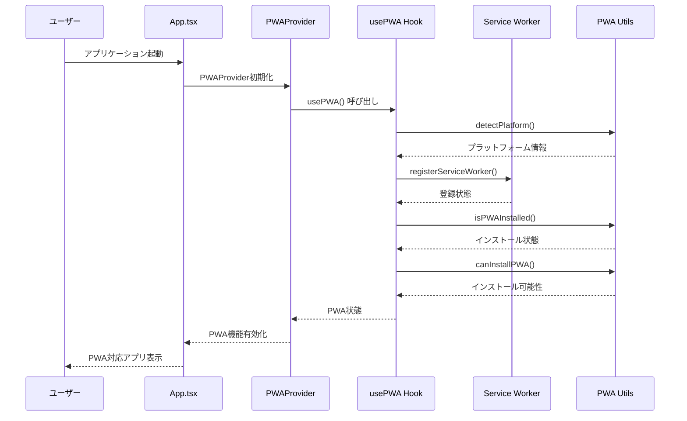
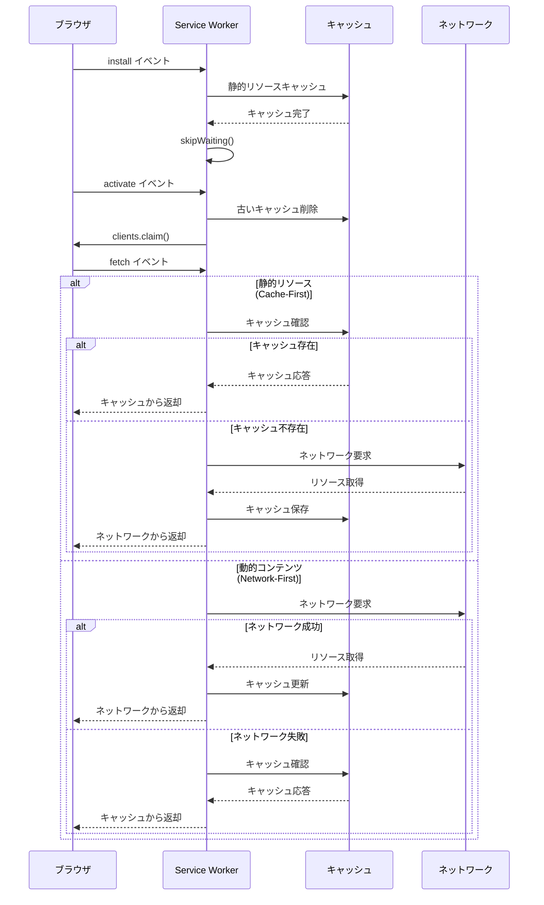
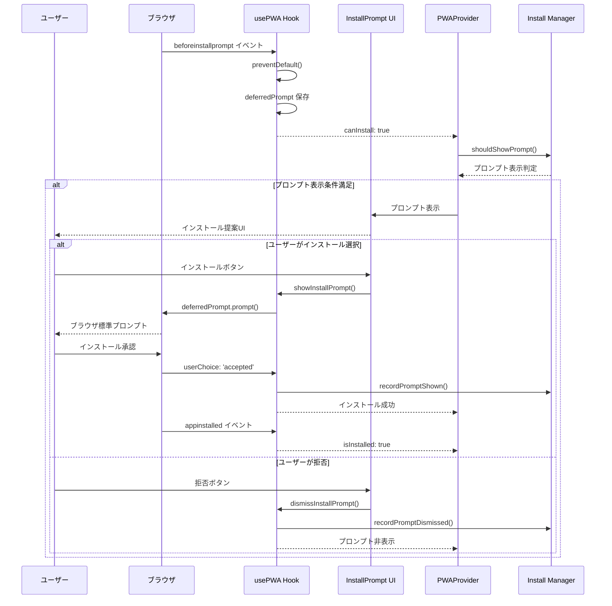
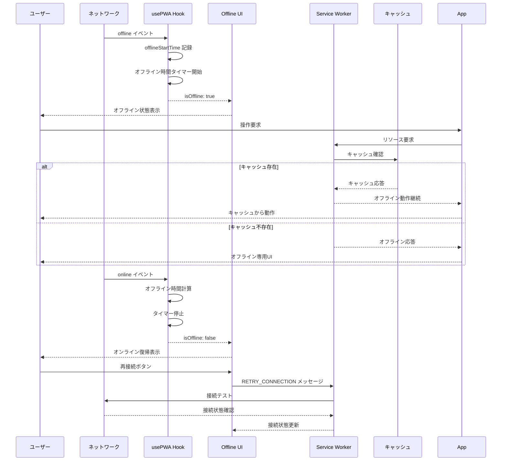
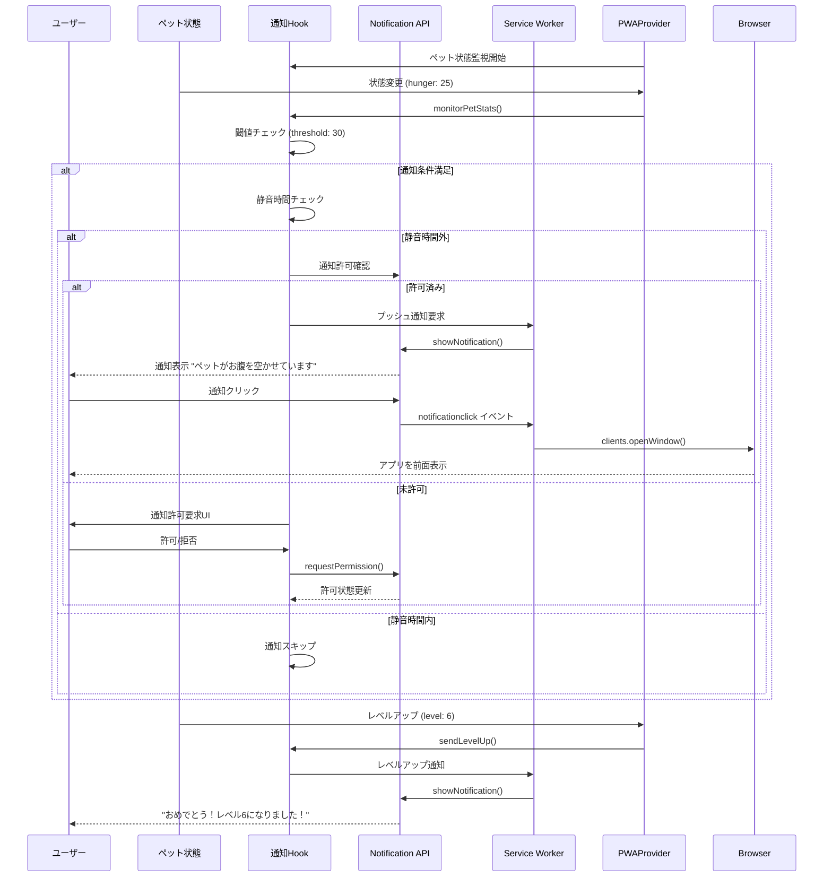
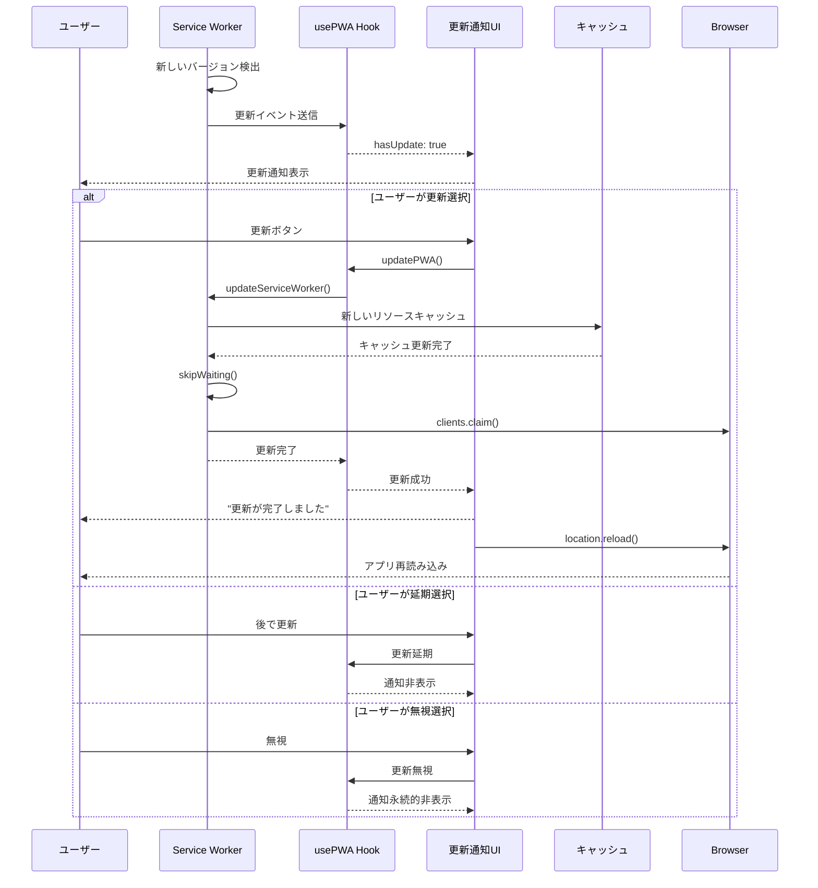

# PWA機能実装ドキュメント

## 概要

AI Pet BuddyのProgressive Web App (PWA) 機能の包括的な実装ドキュメントです。本機能により、Webアプリケーションがネイティブアプリのような体験を提供し、オフライン対応、プッシュ通知、ホーム画面へのインストールなどの機能を実現しています。

## アーキテクチャ概要

### コンポーネント構成

```
PWA Architecture
├── Service Worker (public/sw.js)
│   ├── キャッシュ戦略管理
│   ├── オフライン機能提供
│   └── バックグラウンド同期
├── PWA Provider (src/components/PWAProvider.tsx)
│   ├── PWA状態統合管理
│   ├── UI コンポーネント制御
│   └── ペット状態監視
├── PWA Hook (src/hooks/usePWA.ts)  
│   ├── PWA状態管理
│   ├── イベント処理
│   └── インストール管理
├── 通知システム (src/hooks/useNotification.ts)
│   ├── プッシュ通知管理
│   ├── ペット状態監視
│   └── 通知設定管理
└── UI Components
    ├── InstallPrompt - インストールプロンプト
    ├── OfflineIndicator - オフライン状態表示
    ├── UpdateNotification - 更新通知
    └── NotificationSettings - 通知設定
```

### 主要機能

1. **Service Worker による高度なキャッシュ戦略**
2. **オフライン対応とデータ同期**
3. **プラットフォーム対応インストールプロンプト**
4. **ペット状態連動プッシュ通知**
5. **自動アップデート機能**

## 処理フロー - シーケンス図

### 1. PWA初期化フロー



### 2. Service Worker ライフサイクル



### 3. インストールプロンプト管理



### 4. オフライン状態管理



### 5. プッシュ通知システム



### 6. アプリ更新プロセス



## 技術仕様

### キャッシュ戦略

| リソースタイプ | 戦略 | 説明 |
|---------------|------|------|
| 静的アセット | Cache-First | JS, CSS, 画像などはキャッシュ優先 |
| 動的コンテンツ | Network-First | APIレスポンスなどはネットワーク優先 |
| その他 | Stale-While-Revalidate | キャッシュを返しつつバックグラウンドで更新 |

### 通知トリガー条件

| 通知タイプ | デフォルト閾値 | デフォルト間隔 |
|-----------|---------------|---------------|
| 空腹通知 | 30以下 | 30分 |
| エネルギー通知 | 20以下 | 60分 |
| 幸福度通知 | 40以下 | 45分 |
| レベルアップ | 即座 | - |
| 進化 | 即座 | - |

### プラットフォーム対応

| プラットフォーム | インストール方法 | 特別対応 |
|-----------------|-----------------|----------|
| iOS Safari | 手動（ホーム画面に追加） | インストール手順ガイド表示 |
| Android Chrome | 自動（Install Prompt） | ブラウザ標準プロンプト |
| Desktop | 自動（Install Prompt） | ブラウザ標準プロンプト |

## ファイル構成

```
PWA関連ファイル
├── public/
│   ├── manifest.json          # PWA マニフェスト
│   ├── sw.js                  # Service Worker
│   └── icons/                 # アイコンファイル群
├── src/
│   ├── types/PWA.ts           # PWA型定義
│   ├── hooks/
│   │   ├── usePWA.ts          # PWA統合フック
│   │   └── useNotification.ts # 通知管理フック
│   ├── utils/
│   │   ├── pwaUtils.ts        # PWAユーティリティ
│   │   ├── serviceWorker.ts   # Service Worker管理
│   │   └── pushNotification.ts # プッシュ通知処理
│   └── components/
│       ├── PWAProvider.tsx    # PWA統合プロバイダー
│       ├── InstallPrompt.tsx  # インストールプロンプト
│       ├── OfflineIndicator.tsx # オフライン表示
│       ├── UpdateNotification.tsx # 更新通知
│       └── NotificationSettings.tsx # 通知設定
```

## 開発者向け情報

### PWA機能の拡張

新しいPWA機能を追加する場合：

1. `src/types/PWA.ts` に型定義を追加
2. `src/hooks/usePWA.ts` にロジックを実装
3. `src/components/PWAProvider.tsx` でUI統合
4. 必要に応じてService Workerに機能追加

### テスト方法

```bash
# PWA関連テストの実行
npm run test -- PWA
npm run test -- pwa
npm run test -- notification

# 特定コンポーネントのテスト
npm run test -- InstallPrompt
npm run test -- OfflineIndicator
```

### デバッグ情報

ブラウザ開発者ツールでPWA状態を確認：

```javascript
// PWA状態の確認
console.log('Service Worker:', navigator.serviceWorker);
console.log('Installation:', window.deferredPrompt);
console.log('Notification:', Notification.permission);
console.log('Online:', navigator.onLine);
```

## まとめ

本PWA実装により、AI Pet Buddyは：

- **ネイティブアプリ級の体験**を提供
- **完全オフライン対応**で安定動作
- **プラットフォーム最適化**で幅広いデバイス対応
- **インテリジェント通知**でユーザーエンゲージメント向上
- **自動更新機能**で常に最新版を提供

これらの機能により、従来のWebアプリケーションの制約を超えた、真のハイブリッドアプリケーションとして動作します。