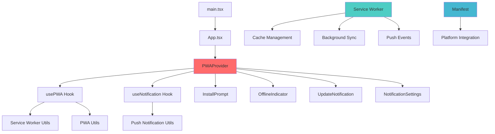
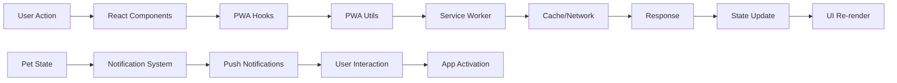
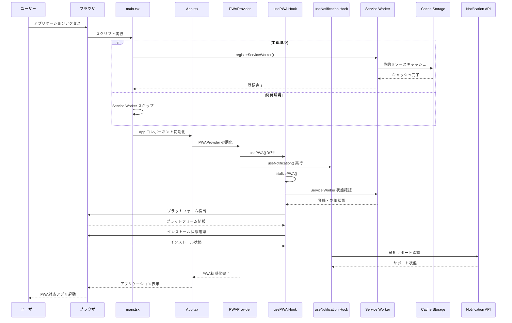
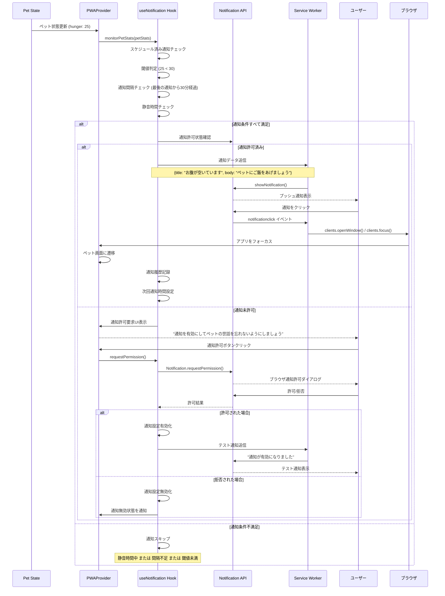
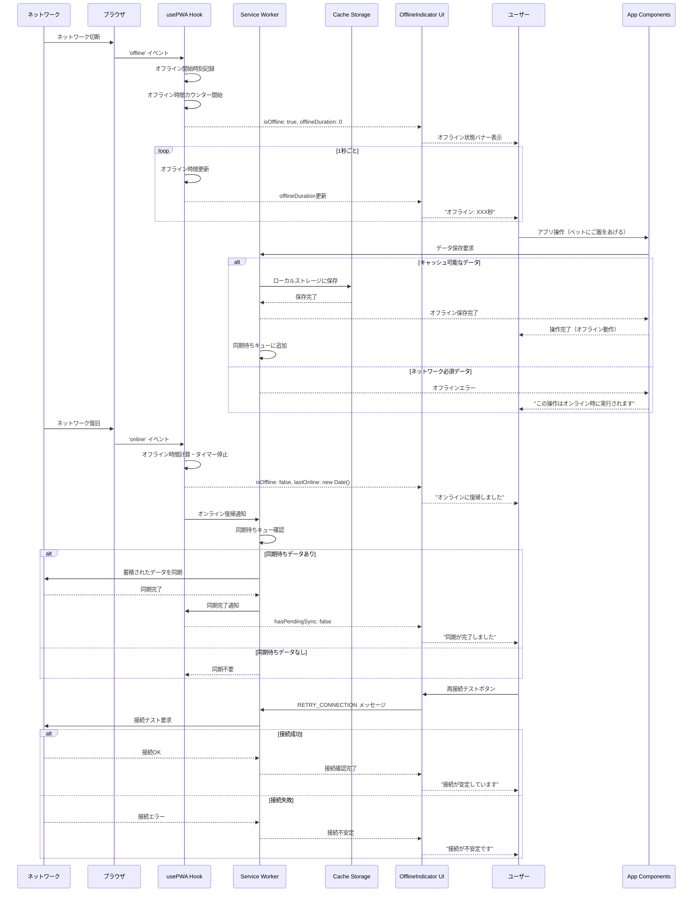
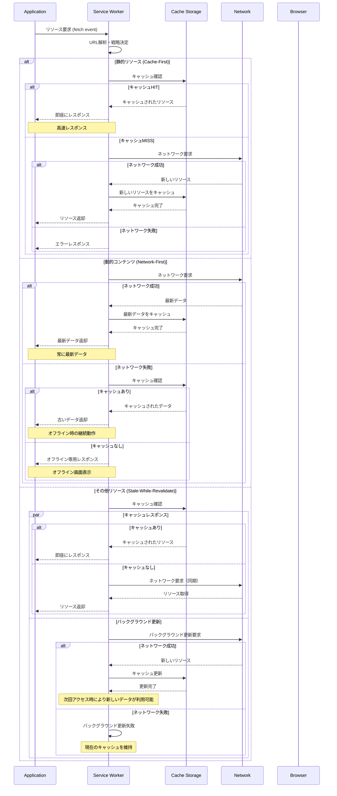
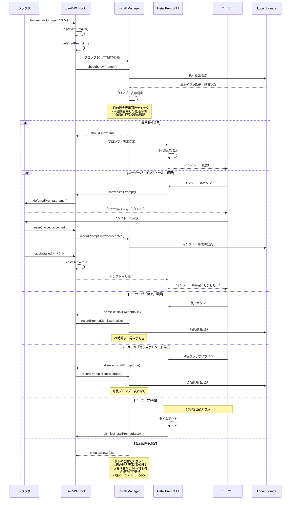
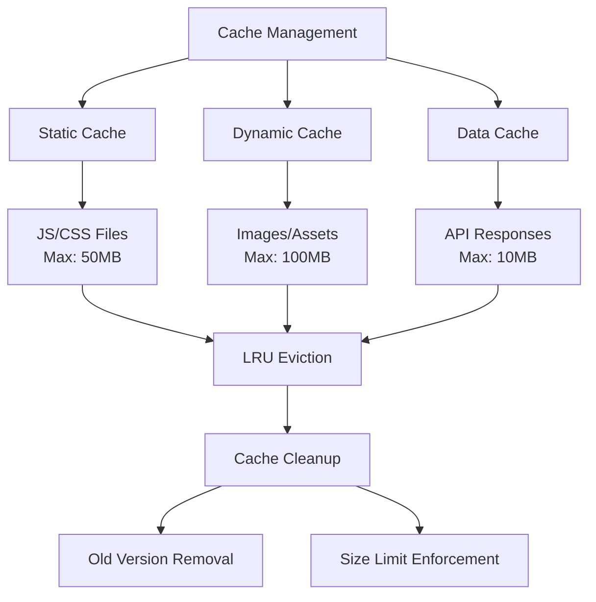
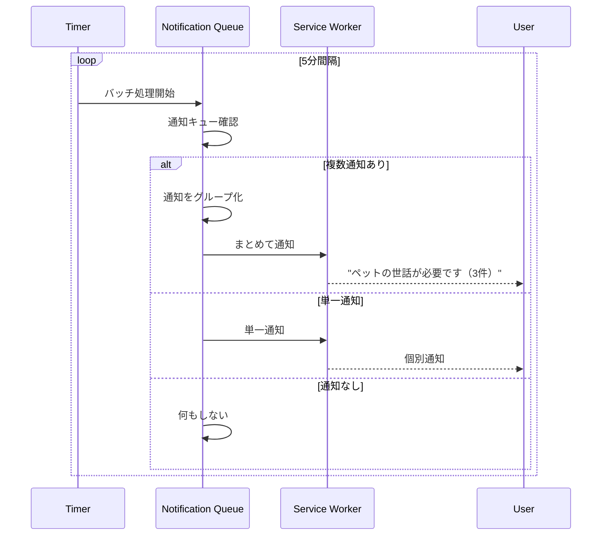
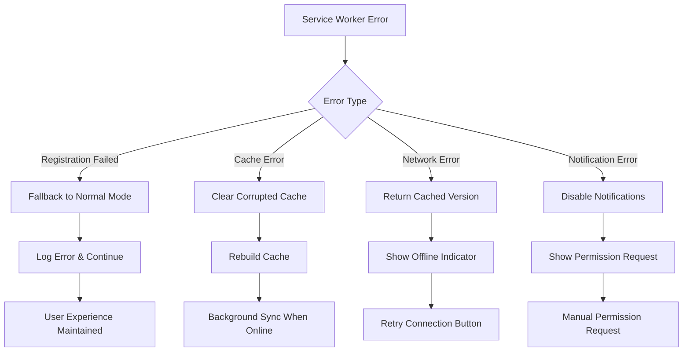

# PWA技術アーキテクチャ詳細

## システム全体のアーキテクチャ

### 1. コンポーネント間の相互作用

### 2. データフロー アーキテクチャ

## 詳細シーケンス図

### 1. アプリケーション起動時のPWA初期化

### 2. ペット状態変更による通知システム

### 3. オフライン/オンライン状態の詳細管理

### 4. キャッシュ戦略の詳細フロー

### 5. インストールプロンプトの高度な制御

## パフォーマンス最適化

### キャッシュサイズ管理

### 通知のバッチ処理

## エラーハンドリング

### Service Worker エラー対応

この技術アーキテクチャドキュメントは、PWA機能の実装における詳細な処理フローと技術的な側面を包括的に説明しています。開発者がシステムの動作を理解し、機能拡張や問題解決を行う際の技術的な指針として活用できます。