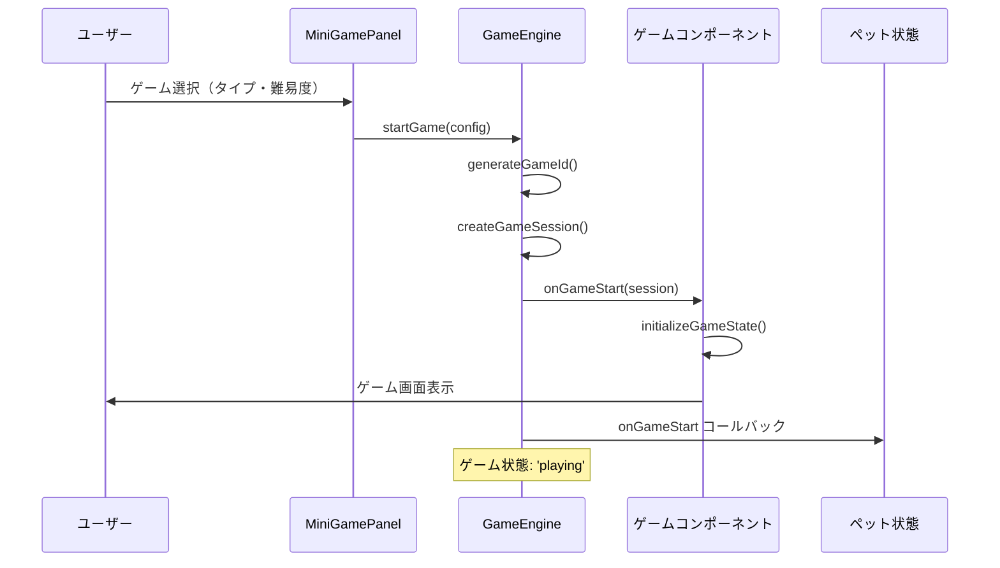
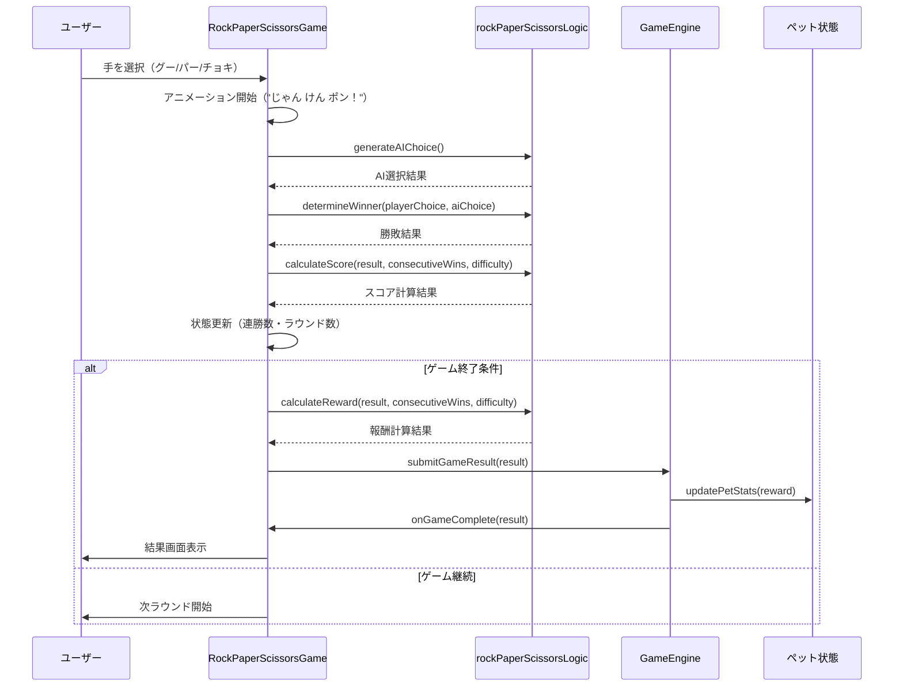
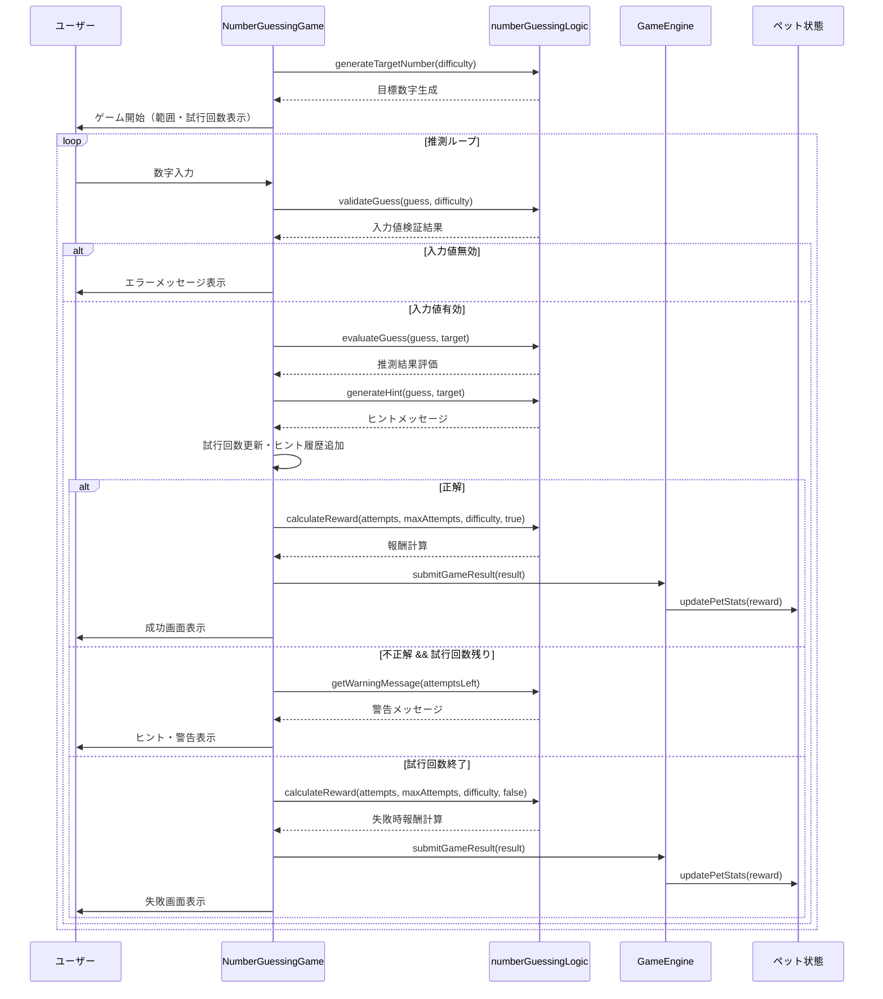
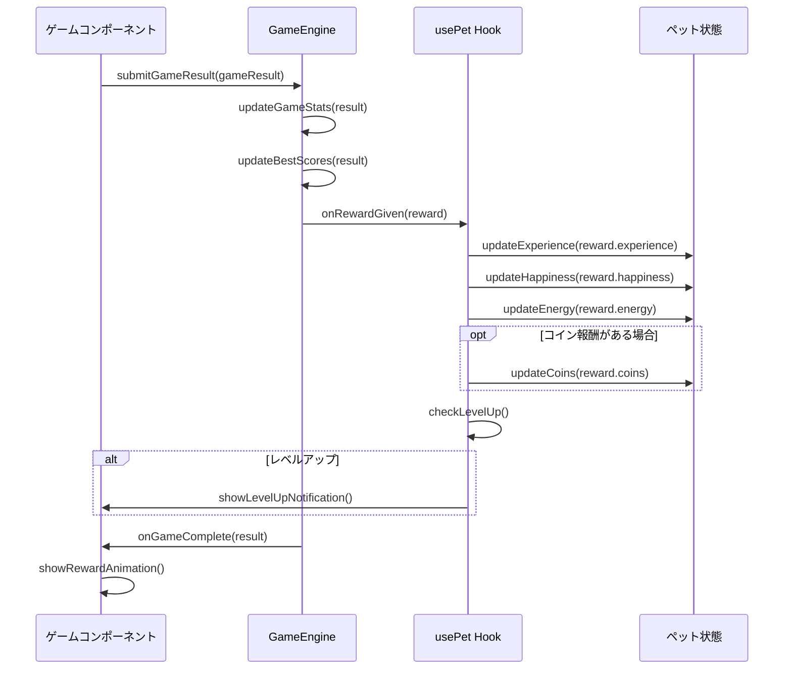

# ミニゲーム機能 技術仕様書

## 📋 概要

このドキュメントは、AI Pet Buddy アプリのミニゲーム機能について詳細な技術仕様を説明します。
特に Phase 4 で新しく追加された2つのゲーム（じゃんけん・数当てゲーム）の処理フローとアーキテクチャを中心に記載しています。

## 🎮 実装済みミニゲーム一覧

| ゲームタイプ | 難易度 | 説明 | 主な特徴 |
|------------|-------|------|---------|
| Memory Game | Easy/Medium/Hard | 記憶ゲーム | シーケンス記憶・反復練習 |
| Reflex Game | Easy/Medium/Hard | 反射神経ゲーム | 反応速度測定 |
| Quiz Game | Easy/Medium/Hard | クイズゲーム | ペット・一般知識 |
| **Rock-Paper-Scissors** | Easy/Medium/Hard | **じゃんけん** | **複数ラウンド・連勝ボーナス** |
| **Number Guessing** | Easy/Medium/Hard | **数当てゲーム** | **効率的推測・ヒントシステム** |

## 🏗️ アーキテクチャ概要

```
src/
├── types/
│   └── Game.ts                    # 全ゲーム共通型定義
├── utils/
│   ├── gameEngine.ts              # ゲームエンジン（統括管理）
│   ├── rockPaperScissorsLogic.ts  # じゃんけんゲームロジック
│   └── numberGuessingLogic.ts     # 数当てゲームロジック
├── components/
│   ├── MiniGamePanel.tsx          # ゲーム選択UI
│   └── games/
│       ├── RockPaperScissorsGame.tsx  # じゃんけんUI
│       └── NumberGuessingGame.tsx     # 数当てUI
└── hooks/
    └── usePet.ts                  # ペット状態管理
```

## 🔄 シーケンス図

### 1. ゲーム開始フロー



### 2. じゃんけんゲーム処理フロー



### 3. 数当てゲーム処理フロー



### 4. 報酬システム処理フロー



## 🎯 ゲーム固有仕様

### じゃんけんゲーム（Rock-Paper-Scissors）

#### 基本仕様
- **ラウンド数**: Easy(3回)、Medium(5回)、Hard(7回)
- **選択肢**: グー(✊)、パー(✋)、チョキ(✌️)
- **AI戦略**: 完全ランダム選択
- **アニメーション**: "じゃん けん ポン！" タイミング演出

#### スコア計算式
```typescript
// 基本スコア
const baseScores = {
  win: { easy: 100, medium: 150, hard: 200 },
  draw: { easy: 25, medium: 35, hard: 50 },
  lose: { easy: 10, medium: 15, hard: 20 }
};

// 連勝ボーナス
const totalScore = baseScore + (consecutiveWins * 25);
```

#### 報酬計算式
```typescript
// 基本報酬
const baseRewards = {
  win: { 
    easy: { experience: 75, happiness: 10, energy: -3 },
    medium: { experience: 100, happiness: 12, energy: -4 },
    hard: { experience: 150, happiness: 15, energy: -5 }
  }
  // draw, lose...
};

// 連勝ボーナス
const experienceBonus = Math.floor(consecutiveWins * 0.2 * baseExperience);
const coinsReward = Math.floor(consecutiveWins / 2) + 1; // 勝利時のみ
```

### 数当てゲーム（Number Guessing）

#### 基本仕様
- **数字範囲**: Easy(1-50)、Medium(1-100)、Hard(1-200)
- **最大試行回数**: Easy(8回)、Medium(10回)、Hard(12回)
- **ヒントシステム**: "もっと大きい/小さい" + 警告メッセージ
- **入力検証**: 範囲外・非整数・無効値チェック

#### スコア計算式
```typescript
// 効率性に基づくスコア
const efficiency = (maxAttempts - attempts + 1) / maxAttempts;
const score = Math.floor(baseReward * efficiency);

// 失敗時は10%のスコア
const failureScore = Math.floor(baseReward * 0.1);
```

#### 報酬計算式
```typescript
// 効率乗数（0.5 - 2.0の範囲）
const efficiencyMultiplier = 0.5 + (efficiency * 1.5);

// パーフェクトゲーム（1回で正解）ボーナス
const perfectBonus = attempts === 1 ? 1.5 : 1.0;

// 最終報酬
const finalExperience = baseExperience * efficiencyMultiplier * perfectBonus;
const specialCoins = attempts === 1 ? 3 : 0; // パーフェクト特別報酬
```

## 🧪 テスト戦略

### 単体テスト構成

#### ロジックレイヤーテスト
```
src/utils/__tests__/
├── rockPaperScissorsLogic.test.ts  # 24テスト
│   ├── 勝敗判定ロジック
│   ├── スコア計算アルゴリズム
│   ├── 報酬計算システム
│   └── ユーティリティ関数
└── numberGuessingLogic.test.ts     # 23テスト
    ├── 数字生成・範囲検証
    ├── 推測評価・ヒント生成
    ├── スコア・報酬計算
    └── 入力値検証システム
```

#### UIコンポーネントテスト
```
src/components/games/__tests__/
├── RockPaperScissorsGame.test.tsx  # 13テスト
│   ├── 選択肢クリック動作
│   ├── ゲーム状態変化
│   ├── アニメーション制御
│   └── 結果表示システム
└── NumberGuessingGame.test.tsx     # 12テスト
    ├── 数字入力・送信
    ├── ヒント表示システム
    ├── エラーハンドリング
    └── ゲーム完了処理
```

### テスト実行結果
```bash
Test Suites: 12 passed, 12 total
Tests:       72 passed, 72 total
Coverage:    > 95% statements, functions, lines
```

## 🔧 設定・カスタマイズ

### 難易度調整
ゲームバランスは以下のファイルで調整可能：

```typescript
// じゃんけん設定
const ROUNDS_BY_DIFFICULTY = {
  easy: 3, medium: 5, hard: 7
};

// 数当て設定
const DIFFICULTY_SETTINGS = {
  easy: { min: 1, max: 50, maxAttempts: 8 },
  medium: { min: 1, max: 100, maxAttempts: 10 },
  hard: { min: 1, max: 200, maxAttempts: 12 }
};
```

### 報酬バランス調整
報酬値は各ロジックファイル内の定数で調整：

```typescript
// 基本報酬テーブル
const baseRewards = {
  // 経験値・幸福度・エネルギー・コインの基準値
};

// ボーナス計算式
const bonusMultipliers = {
  // 連勝・効率・パーフェクト等のボーナス倍率
};
```

## 📈 パフォーマンス考慮事項

### メモリ使用量最適化
- ゲーム履歴は最新50件のみ保持
- 大きなアニメーション画像は遅延ロード
- 不要なstate更新の抑制

### レンダリング最適化
- React.memo を使用したコンポーネント最適化
- useCallback でイベントハンドラーの再生成防止
- CSS Transform を使用したGPUアクセラレーション

### ユーザビリティ
- ローディング状態の適切な表示
- エラー時の分かりやすいメッセージ
- アクセシビリティ対応（ARIA属性、キーボード操作）

## 🚀 今後の拡張予定

### Phase 5以降の機能
- オンライン対戦モード
- デイリーチャレンジ
- アチーブメントシステム
- カスタムゲーム設定

### パフォーマンス改善
- サーバーサイド処理の導入
- PWA対応強化
- オフライン機能拡張

---

**🔍 詳細情報**
- 実装コード: `src/utils/`, `src/components/games/`
- テストファイル: `src/**/__tests__/`, `src/**/*.test.tsx`
- 型定義: `src/types/Game.ts`
- 設定ファイル: `vitest.config.ts`, `tsconfig.json`