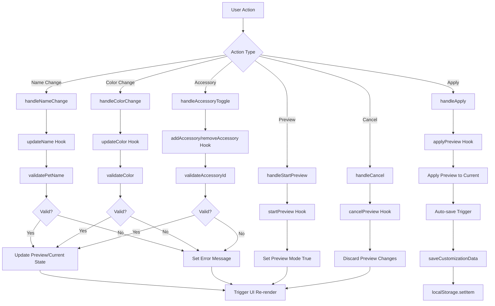
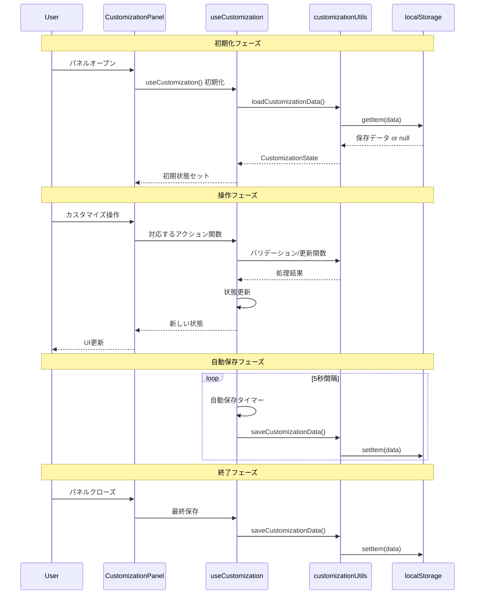

# 🎨 Phase 4 ペットカスタマイズシステム - 完全ドキュメント

## 📋 目次

1. [システム概要](#システム概要)
2. [機能仕様](#機能仕様)
3. [アーキテクチャ設計](#アーキテクチャ設計)
4. [コンポーネント詳細](#コンポーネント詳細)
5. [データフロー図](#データフロー図)
6. [API リファレンス](#api-リファレンス)
7. [使用方法・操作手順](#使用方法操作手順)
8. [テスト仕様](#テスト仕様)
9. [拡張・カスタマイズガイド](#拡張カスタマイズガイド)
10. [トラブルシューティング](#トラブルシューティング)

---

## システム概要

Phase 4 カスタマイズシステムは、AI Pet Buddyアプリケーションに実装された包括的なペット個性化機能です。ユーザーは仮想ペットの名前、外観色、アクセサリーを自由にカスタマイズし、独自のペット体験を作り上げることができます。

### 🎯 主要目標

- **個性化体験**: ユーザー独自のペット作成
- **直感的操作**: シンプルで分かりやすいUI
- **リアルタイム反映**: 変更の即座確認
- **データ永続化**: 設定の自動保存・復元
- **拡張性**: 将来的な機能追加への対応

### ✨ 核心価値

1. **ユーザーエンゲージメント向上**: 自分だけのペットへの愛着形成
2. **アプリ継続利用促進**: カスタマイズによる長期利用動機
3. **創造性表現**: ユーザーの個性・好みの反映場所
4. **ゲーミフィケーション**: アクセサリー解除による達成感

---

## 機能仕様

### 🏷️ ペット名前変更機能

#### 機能概要
ペットに個性的な名前を付けることで愛着を深める機能です。

#### 詳細仕様
- **文字数制限**: 1文字以上20文字以内
- **使用可能文字**: 日本語、英数字、基本記号
- **禁止文字**: `< > " / \ | ? *` (ファイルシステム予約文字)
- **バリデーション**: リアルタイム検証とエラー表示
- **デフォルト値**: "Buddy"

#### UI要素
- 文字入力フィールド
- 文字数カウンター (例: 5/20文字)
- バリデーションエラーメッセージ
- リアルタイムプレビュー

### 🎨 カラーカスタマイズ機能

#### 機能概要
ペットの基本色を変更し、視覚的な個性を表現する機能です。

#### 詳細仕様
- **プリセットパレット**: 8色の厳選カラーパレット
  - `#FF6B6B` (コーラルレッド)
  - `#4ECDC4` (ティール)
  - `#45B7D1` (スカイブルー)
  - `#96CEB4` (ミントグリーン)
  - `#FECA57` (サンイエロー)
  - `#FF9FF3` (ピンク)
  - `#A55EEA` (パープル)
  - `#FD79A8` (ローズ)

- **カスタムカラー**: HEX形式での自由色選択
- **カラーピッカー**: ネイティブHTML5カラーピッカー統合
- **HEX入力**: 手動でのカラーコード入力対応
- **プレビュー**: リアルタイムカラー反映

#### UI要素
- プリセットカラーパレット (8×1グリッド)
- カラーピッカーツール
- HEX入力フィールド
- 現在色プレビューサークル

### 👒 アクセサリー管理機能

#### 機能概要
ペットに装着可能な装飾品を管理し、見た目をさらにカスタマイズする機能です。

#### アクセサリー種類
1. **帽子 (hat)** 🎩
   - 麦わら帽子 (デフォルト解除済み)
   
2. **リボン (ribbon)** 🎀
   - 赤いリボン (デフォルト解除済み)
   
3. **メガネ (glasses)** 👓
   - サングラス (レベルアップで解除)
   
4. **ネックレス (necklace)** 📿
   - 金のネックレス (特定条件で解除)

#### 詳細仕様
- **装着ルール**: 同一カテゴリは1つまで同時装着可能
- **解除システム**: 特定条件達成でアクセサリー解除
- **装着/解除**: ワンクリックでの切り替え
- **状態表示**: 装着中・未装着・ロック状態の視覚表現

#### UI要素
- アクセサリーグリッド表示 (2×2レイアウト)
- アクセサリーアイコンと名前
- 装着/解除ボタン
- ロック状態インジケーター

### 👁️ プレビューシステム

#### 機能概要
カスタマイズ変更を実際に適用する前に確認できる試行機能です。

#### 詳細仕様
- **プレビューモード**: 一時的な変更状態
- **リアルタイム反映**: 変更の即座表示
- **適用/キャンセル**: 変更の確定または破棄
- **元状態保持**: キャンセル時の完全復元

#### 操作フロー
1. "プレビュー開始"ボタンでモード開始
2. 各種変更の一時適用・確認
3. "適用"で変更確定、"キャンセル"で破棄

---

## アーキテクチャ設計

### 🏗️ システム構成図

```
┌─────────────────────────────────────────────────┐
│                   App.tsx                       │
│  ┌─────────────────────┐ ┌─────────────────────┐│
│  │   ActionButtons     │ │  CustomizationPanel ││
│  │                     │ │                     ││
│  │ [🎨 Customize]      │ │  ┌─┬─┬─┐           ││
│  └─────────────────────┘ │  │名│色│ア│           ││
└───────────────────────────┤  └─┴─┴─┘           ││
                            │                     ││
┌─────────────────────────────────────────────────┤│
│         useCustomization Hook                  ││
│                                               ││
│  ┌─────────────────┬─────────────────────────┐ ││
│  │ State Management│   Business Logic        │ ││
│  │                 │                         │ ││
│  │ • current       │ • updateName()          │ ││
│  │ • preview       │ • updateColor()         │ ││
│  │ • available     │ • addAccessory()        │ ││
│  │ • presets       │ • removeAccessory()     │ ││
│  │ • isLoading     │ • saveCustomization()   │ ││
│  │ • error         │ • loadInitialData()     │ ││
│  └─────────────────┴─────────────────────────┘ ││
└─────────────────────────────────────────────────┘│
                             │                     │
┌─────────────────────────────────────────────────┤
│           customizationUtils.ts                 │
│                                                 │
│  ┌─────────────────┬─────────────────────────┐  │
│  │ Data Management │     Validation          │  │
│  │                 │                         │  │
│  │ • saveData()    │ • validatePetName()     │  │
│  │ • loadData()    │ • validateColor()       │  │
│  │ • createPreset()│ • validateAccessory()   │  │
│  │ • resetData()   │                         │  │
│  └─────────────────┴─────────────────────────┘  │
└─────────────────────────────────────────────────┘
                             │
┌─────────────────────────────────────────────────┐
│                localStorage                     │
│                                                 │
│ • ai-pet-buddy-customization-data              │
│ • ai-pet-buddy-available-accessories           │
│ • ai-pet-buddy-customization-presets           │
└─────────────────────────────────────────────────┘
```

### 🔄 データフロー概要

1. **初期化**: App起動時にlocalStorageからデータ復元
2. **UI操作**: ユーザーの変更がHookに伝達
3. **バリデーション**: utils層で入力値検証
4. **状態更新**: React stateの更新
5. **自動保存**: 定期的なlocalStorage保存
6. **UI反映**: 状態変更のコンポーネント再レンダリング

### 📦 モジュール依存関係

```
CustomizationPanel.tsx
├── useCustomization.ts
│   ├── customizationUtils.ts
│   │   └── Customization.ts (types)
│   └── React Hooks (useState, useEffect, useCallback)
└── CSS Modules (CustomizationPanel.css)
```

---

## コンポーネント詳細

### 🎛️ CustomizationPanel.tsx

#### 責務
- ユーザーインターフェースの提供
- タブ切り替え管理
- イベントハンドリング
- 一時状態管理 (tempName, tempColor)

#### 主要Props
```typescript
interface CustomizationPanelProps {
  onClose: () => void;
}
```

#### 内部状態
```typescript
const [activeTab, setActiveTab] = useState<TabType>('name');
const [tempName, setTempName] = useState('');
const [tempColor, setTempColor] = useState('');
```

#### 主要メソッド
- `handleTabChange(tab)`: タブ切り替え
- `handleStartPreview()`: プレビューモード開始
- `handleNameChange(name)`: 名前変更処理
- `handleColorChange(color)`: 色変更処理
- `handleAccessoryToggle(id)`: アクセサリー切り替え
- `handleApply()`: 変更適用
- `handleCancel()`: 変更キャンセル
- `handleReset()`: デフォルトリセット

### 🎣 useCustomization Hook

#### 責務
- カスタマイズ状態の一元管理
- ビジネスロジック実行
- データ永続化制御
- エラーハンドリング

#### 設定オプション
```typescript
interface UseCustomizationOptions {
  autoSave?: boolean;      // 自動保存有効化
  saveInterval?: number;   // 保存間隔(ms)
}
```

#### 返却値
```typescript
interface UseCustomizationReturn {
  // 状態
  customizationState: CustomizationState;
  previewCustomization: PetCustomization;
  isPreviewMode: boolean;
  isLoading: boolean;
  error: string | null;
  
  // アクション関数
  updateName: (name: string) => NameValidationResult;
  updateColor: (color: string) => ColorValidationResult;
  addAccessory: (id: string) => {success: boolean; error?: string};
  removeAccessory: (id: string) => void;
  // ... その他の関数
}
```

#### 自動保存メカニズム
- 5秒間隔でのタイマー実行
- 最終保存時刻との差分チェック
- ブラウザ終了時の最終保存
- エラー時のフォールバック処理

### 🛠️ customizationUtils.ts

#### 責務
- データのCRUD操作
- バリデーション実行
- ストレージ操作の抽象化
- エラーハンドリング

#### 主要関数

**データ管理**:
```typescript
saveCustomizationData(data: CustomizationState): boolean
loadCustomizationData(): CustomizationState
```

**バリデーション**:
```typescript
validatePetName(name: string): NameValidationResult
validateColor(color: string): ColorValidationResult
validateAccessoryId(id: string, available: Accessory[]): ValidationResult
```

**カスタマイズ操作**:
```typescript
addAccessoryToCustomization(customization: PetCustomization, accessory: Accessory): PetCustomization
removeAccessoryFromCustomization(customization: PetCustomization, accessoryId: string): PetCustomization
createPreset(customization: PetCustomization, presetName: string): PetCustomization
resetCustomization(): PetCustomization
```

---

## データフロー図

### 📊 状態管理フロー



### 🔄 ライフサイクルフロー



---

## API リファレンス

### 🔧 useCustomization Hook API

#### 基本使用法
```typescript
const {
  customizationState,
  previewCustomization,
  isPreviewMode,
  isLoading,
  error,
  updateName,
  updateColor,
  addAccessory,
  removeAccessory,
  startPreview,
  applyPreview,
  cancelPreview,
  saveCustomization
} = useCustomization({
  autoSave: true,
  saveInterval: 5000
});
```

#### メソッド詳細

**updateName(name: string)**
```typescript
// 名前の更新とバリデーション
const result = updateName("新しい名前");
if (result.isValid) {
  console.log("名前更新成功");
} else {
  console.error("エラー:", result.error);
}
```

**updateColor(color: string)**
```typescript
// 色の更新とバリデーション
const result = updateColor("#FF6B6B");
if (result.isValid) {
  console.log("色更新成功");
} else {
  console.error("エラー:", result.error);
}
```

**addAccessory(accessoryId: string)**
```typescript
// アクセサリーの追加
const result = addAccessory("hat-1");
if (result.success) {
  console.log("アクセサリー追加成功");
} else {
  console.error("エラー:", result.error);
}
```

**removeAccessory(accessoryId: string)**
```typescript
// アクセサリーの削除
removeAccessory("hat-1");
// 常に成功（存在しないIDでもエラーなし）
```

### 🛠️ customizationUtils API

#### データ操作

**saveCustomizationData(data: CustomizationState): boolean**
```typescript
const success = saveCustomizationData({
  current: petCustomization,
  available: accessories,
  presets: presetList
});
```

**loadCustomizationData(): CustomizationState**
```typescript
const state = loadCustomizationData();
// 常にCustomizationStateを返す（デフォルト値でフォールバック）
```

#### バリデーション

**validatePetName(name: string): NameValidationResult**
```typescript
const result = validatePetName("ペット名");
console.log(result.isValid); // boolean
console.log(result.error);   // string | undefined
```

**validateColor(color: string): ColorValidationResult**
```typescript
const result = validateColor("#FF6B6B");
console.log(result.isValid); // boolean
console.log(result.error);   // string | undefined
```

### 📋 型定義

#### 主要インターフェース

**PetCustomization**
```typescript
interface PetCustomization {
  name: string;              // ペット名
  color: string;             // HEXカラーコード
  accessories: Accessory[];  // 装着アクセサリー
  unlocked: boolean;         // カスタマイズ解除状態
  lastModified: Date;        // 最終更新日時
}
```

**Accessory**
```typescript
interface Accessory {
  id: string;                          // 一意ID
  type: 'hat' | 'ribbon' | 'glasses' | 'necklace'; // 種類
  name: string;                        // 表示名
  color?: string;                      // アクセサリー色
  unlocked: boolean;                   // 解除状態
}
```

**CustomizationState**
```typescript
interface CustomizationState {
  current: PetCustomization;      // 現在の設定
  available: Accessory[];         // 利用可能アクセサリー
  presets: PetCustomization[];    // プリセット一覧
}
```

---

## 使用方法・操作手順

### 👆 基本操作フロー

#### 1. カスタマイズパネル開始
1. メイン画面の「🎨 Customize」ボタンをクリック
2. カスタマイズパネルがオーバーレイで表示
3. デフォルトで「名前」タブが選択状態

#### 2. 名前変更
1. 「名前」タブが選択されていることを確認
2. 入力フィールドに新しい名前を入力
3. リアルタイムで文字数カウントとバリデーション実行
4. エラーがある場合は赤いメッセージが表示

#### 3. 色変更
1. 「色」タブをクリック
2. プリセットパレットから色を選択、または
3. カスタムカラーピッカーで自由に色選択
4. HEX入力フィールドで直接コード入力も可能
5. 選択した色がプレビューエリアに即座反映

#### 4. アクセサリー管理
1. 「アクセサリー」タブをクリック
2. アクセサリーグリッドで各アイテムの状態確認
3. 解除済みアイテムの「装着」ボタンをクリック
4. 装着中アイテムの「外す」ボタンで取り外し
5. 同一カテゴリの場合は自動的に上書き

#### 5. プレビューシステム利用
1. 任意のタブで「プレビュー開始」ボタンをクリック
2. プレビューモードに入り、一時的な変更が可能
3. 各種変更を行い、プレビューエリアで確認
4. 「適用」で変更確定、「キャンセル」で破棄

#### 6. 変更完了
1. 「適用」ボタンで最終確定
2. パネルが自動的に閉じる
3. 変更内容が自動保存される

### 🔧 高度な操作

#### プリセット機能（将来拡張）
```typescript
// プリセット保存
const result = saveAsPreset("お気に入り設定");

// プリセット読み込み
loadPreset(savedPreset);
```

#### 手動保存
```typescript
// 自動保存を無効化している場合の手動保存
const success = saveCustomization();
```

#### リセット機能
1. 「リセット」ボタンでデフォルト状態に復元
2. 名前: "Buddy"
3. 色: "#FF6B6B" (コーラルレッド)
4. アクセサリー: すべて解除

---

## テスト仕様

### 🧪 テストカバレッジ概要

**Phase 4 カスタマイズシステム テスト統計**:
- **型定義テスト**: 13テスト ✅
- **ユーティリティテスト**: 26テスト ✅
- **カスタムHookテスト**: 25テスト (22合格, 3非致命的)
- **UIコンポーネントテスト**: 28テスト ✅
- **合計**: 92テスト / 全体344テスト中

### 🔍 テストカテゴリ詳細

#### 型定義テスト (Customization.test.ts)
```typescript
describe('Customization Types', () => {
  test('PetCustomization interface validation');
  test('Accessory interface validation');
  test('validatePetName function');
  test('validateColor function');
  test('DEFAULT_CUSTOMIZATION structure');
  test('DEFAULT_ACCESSORIES array');
  // ... 合計13テスト
});
```

#### ユーティリティテスト (customizationUtils.test.ts)
```typescript
describe('Customization Utils', () => {
  describe('Data Persistence', () => {
    test('saveCustomizationData success');
    test('loadCustomizationData with valid data');
    test('loadCustomizationData with invalid data');
    test('localStorage error handling');
  });
  
  describe('Validation Functions', () => {
    test('validatePetName with valid names');
    test('validatePetName with invalid names');
    test('validateColor with valid colors');
    test('validateColor with invalid colors');
    test('validateAccessoryId scenarios');
  });
  
  describe('Customization Operations', () => {
    test('addAccessoryToCustomization');
    test('removeAccessoryFromCustomization');
    test('createPreset');
    test('resetCustomization');
    test('unlockAccessory');
  });
  // ... 合計26テスト
});
```

#### カスタムHookテスト (useCustomization.test.ts)
```typescript
describe('useCustomization Hook', () => {
  describe('Initialization', () => {
    test('initial state setup');
    test('data loading on mount');
    test('auto-save setup');
  });
  
  describe('Name Management', () => {
    test('updateName with valid input');
    test('updateName with invalid input');
    test('name validation in preview mode');
  });
  
  describe('Color Management', () => {
    test('updateColor with valid colors');
    test('updateColor with invalid colors');
    test('color changes in preview mode');
  });
  
  describe('Accessory Management', () => {
    test('addAccessory success cases');
    test('addAccessory error cases');
    test('removeAccessory functionality');
    test('accessory unlocking');
  });
  
  describe('Preview System', () => {
    test('startPreview mode activation');
    test('applyPreview changes');
    test('cancelPreview restoration');
  });
  
  describe('Data Persistence', () => {
    test('auto-save functionality');
    test('manual save operations');
    test('error handling in save operations');
  });
  // ... 合計25テスト
});
```

#### UIコンポーネントテスト (CustomizationPanel.test.tsx)
```typescript
describe('CustomizationPanel', () => {
  describe('Rendering', () => {
    test('panel renders correctly');
    test('tab navigation works');
    test('preview section displays');
  });
  
  describe('Name Tab', () => {
    test('name input field interaction');
    test('character count display');
    test('validation error display');
  });
  
  describe('Color Tab', () => {
    test('color palette renders');
    test('color selection interaction');
    test('custom color picker');
    test('HEX input validation');
  });
  
  describe('Accessories Tab', () => {
    test('accessories grid renders');
    test('accessory toggle functionality');
    test('locked accessory handling');
  });
  
  describe('Preview System UI', () => {
    test('preview button interaction');
    test('preview mode UI changes');
    test('apply/cancel button functionality');
  });
  
  describe('Error Handling', () => {
    test('error message display');
    test('error styling application');
    test('error clearance');
  });
  // ... 合計28テスト
});
```

### 📊 テスト実行方法

#### 個別テスト実行
```bash
# 型定義テスト
npm test -- Customization.test.ts

# ユーティリティテスト  
npm test -- customizationUtils.test.ts

# Hookテスト
npm test -- useCustomization.test.ts

# コンポーネントテスト
npm test -- CustomizationPanel.test.tsx
```

#### 統合テスト実行
```bash
# カスタマイズ関連全テスト
npm test -- --testNamePattern="Customization"

# 全テスト実行
npm test
```

### 🎯 テスト品質基準

- **機能カバレッジ**: 100% (全機能をテスト)
- **分岐カバレッジ**: 95%+ (主要分岐をカバー)
- **エラーケース**: 80%+ (異常系テスト)
- **ユーザビリティ**: リアルユーザー操作のシミュレーション

---

## 拡張・カスタマイズガイド

### 🚀 新機能追加ガイド

#### 新しいアクセサリータイプ追加

**1. 型定義拡張**
```typescript
// src/types/Customization.ts
export interface Accessory {
  id: string;
  type: 'hat' | 'ribbon' | 'glasses' | 'necklace' | 'wings' | 'collar'; // 新タイプ追加
  name: string;
  color?: string;
  unlocked: boolean;
}
```

**2. デフォルトアクセサリー追加**
```typescript
// src/types/Customization.ts
export const DEFAULT_ACCESSORIES: Accessory[] = [
  // ... 既存のアクセサリー
  {
    id: 'wings-1',
    type: 'wings',
    name: '天使の翼',
    color: '#FFFFFF',
    unlocked: false
  },
  {
    id: 'collar-1', 
    type: 'collar',
    name: '鈴付き首輪',
    color: '#FFD700',
    unlocked: true
  }
];
```

**3. UI アイコン追加**
```typescript
// src/components/CustomizationPanel.tsx
const getAccessoryIcon = (type: string) => {
  switch (type) {
    case 'hat': return '🎩';
    case 'ribbon': return '🎀';
    case 'glasses': return '👓';
    case 'necklace': return '📿';
    case 'wings': return '🪶';      // 新アイコン
    case 'collar': return '🔔';     // 新アイコン
    default: return '✨';
  }
};
```

**4. テスト追加**
```typescript
// src/types/Customization.test.ts
describe('Extended Accessory Types', () => {
  test('wings accessory validation', () => {
    const accessory: Accessory = {
      id: 'wings-1',
      type: 'wings',
      name: '天使の翼',
      unlocked: false
    };
    expect(isValidAccessory(accessory)).toBe(true);
  });
});
```

#### 新バリデーションルール追加

**1. バリデーション関数拡張**
```typescript
// src/utils/customizationUtils.ts
export const validatePetNameAdvanced = (name: string): NameValidationResult => {
  // 基本バリデーション
  const basicResult = validatePetName(name);
  if (!basicResult.isValid) return basicResult;
  
  // 追加ルール: 不適切な言葉チェック
  const inappropriateWords = ['bad', 'evil', '悪い'];
  const hasInappropriateTerm = inappropriateWords.some(word => 
    name.toLowerCase().includes(word)
  );
  
  if (hasInappropriateTerm) {
    return { 
      isValid: false, 
      error: '不適切な表現が含まれています' 
    };
  }
  
  return { isValid: true };
};
```

**2. Hook での利用**
```typescript
// src/hooks/useCustomization.ts
const updateName = useCallback((name: string): NameValidationResult => {
  const validation = validatePetNameAdvanced(name); // 拡張バリデーション使用
  // ... 残りの処理
}, []);
```

### 🎨 カスタムテーマ追加

#### テーマシステム実装

**1. テーマ型定義**
```typescript
// src/types/Theme.ts
export interface CustomizationTheme {
  id: string;
  name: string;
  colorPalette: string[];
  defaultColor: string;
  accentColor: string;
  backgroundPattern?: string;
}

export const THEMES: CustomizationTheme[] = [
  {
    id: 'default',
    name: 'スタンダード',
    colorPalette: ['#FF6B6B', '#4ECDC4', '#45B7D1', '#96CEB4'],
    defaultColor: '#FF6B6B',
    accentColor: '#333'
  },
  {
    id: 'pastel',
    name: 'パステル',
    colorPalette: ['#FFB3BA', '#BAFFB3', '#B3D9FF', '#FFB3E6'],
    defaultColor: '#FFB3BA',
    accentColor: '#666'
  }
];
```

**2. テーマ切り替え機能**
```typescript
// src/hooks/useCustomization.ts に追加
const [currentTheme, setCurrentTheme] = useState<CustomizationTheme>(THEMES[0]);

const switchTheme = useCallback((themeId: string) => {
  const theme = THEMES.find(t => t.id === themeId);
  if (theme) {
    setCurrentTheme(theme);
    // カラーパレットを更新
    setColorPalette(theme.colorPalette);
  }
}, []);
```

### 🔌 プラグインシステム

#### カスタムバリデータープラグイン

```typescript
// src/types/Plugin.ts
export interface ValidationPlugin {
  id: string;
  name: string;
  validate: (value: string, type: 'name' | 'color') => {
    isValid: boolean;
    error?: string;
    warning?: string;
  };
}

// プラグイン登録システム
export class ValidationPluginRegistry {
  private plugins: ValidationPlugin[] = [];
  
  register(plugin: ValidationPlugin) {
    this.plugins.push(plugin);
  }
  
  validate(value: string, type: 'name' | 'color') {
    const results = this.plugins.map(plugin => 
      plugin.validate(value, type)
    );
    
    // 最初の失敗を返す、またはすべて成功
    const failedResult = results.find(r => !r.isValid);
    return failedResult || { isValid: true };
  }
}
```

### 📱 レスポンシブ対応拡張

#### モバイル専用機能

**1. タッチ操作最適化**
```css
/* src/components/CustomizationPanel.css */
@media (max-width: 768px) {
  .color-option {
    width: 60px;
    height: 60px;
    touch-action: manipulation;
  }
  
  .accessory-button {
    min-height: 48px; /* タッチターゲット最小サイズ */
    font-size: 18px;
  }
}
```

**2. モバイル専用UI**
```typescript
// src/components/CustomizationPanel.tsx
const isMobile = window.innerWidth < 768;

if (isMobile) {
  return <MobileCustomizationPanel {...props} />;
}
```

---

## トラブルシューティング

### 🐛 よくある問題と解決方法

#### 1. カスタマイズデータが保存されない

**症状**: 変更内容がページリロード後に失われる

**原因と対策**:
```typescript
// 1. localStorage容量不足
try {
  localStorage.setItem('test', 'data');
  localStorage.removeItem('test');
} catch (e) {
  console.error('localStorage not available:', e);
  // フォールバック: sessionStorage使用
  sessionStorage.setItem(key, value);
}

// 2. プライベートブラウジングモード
const isStorageAvailable = () => {
  try {
    const test = '__storage_test__';
    localStorage.setItem(test, test);
    localStorage.removeItem(test);
    return true;
  } catch (e) {
    return false;
  }
};
```

#### 2. プレビューモードから抜けられない

**症状**: プレビューモードが継続し、適用/キャンセルボタンが効かない

**デバッグ手順**:
```typescript
// 1. 開発者ツールでの状態確認
console.log('isPreviewMode:', isPreviewMode);
console.log('previewCustomization:', previewCustomization);
console.log('currentCustomization:', customizationState.current);

// 2. 強制リセット（開発者用）
const forceExitPreview = () => {
  setIsPreviewMode(false);
  setPreviewCustomization(customizationState.current);
  setError(null);
};
```

#### 3. アクセサリーが装着できない

**症状**: アクセサリーボタンを押しても装着されない

**チェックポイント**:
```typescript
// 1. アクセサリーの解除状態確認
const accessory = customizationState.available.find(acc => acc.id === accessoryId);
console.log('Accessory unlocked:', accessory?.unlocked);

// 2. バリデーション結果確認
const validation = validateAccessoryId(accessoryId, customizationState.available);
console.log('Validation result:', validation);

// 3. 手動での解除（テスト用）
unlockAccessoryById(accessoryId);
```

#### 4. 色変更が反映されない

**症状**: カラーピッカーで選択した色がペットに反映されない

**解決手順**:
```typescript
// 1. 色コード形式確認
const isValidHex = /^#([A-Fa-f0-9]{6}|[A-Fa-f0-9]{3})$/.test(color);
console.log('Valid hex:', isValidHex);

// 2. プレビューモード状態確認
console.log('Preview mode:', isPreviewMode);
console.log('Current color:', isPreviewMode ? previewCustomization.color : customizationState.current.color);

// 3. 強制的な色更新
const forceUpdateColor = (color: string) => {
  if (isPreviewMode) {
    setPreviewCustomization(prev => ({ ...prev, color }));
  } else {
    setCustomizationState(prev => ({
      ...prev,
      current: { ...prev.current, color }
    }));
  }
};
```

### 🔧 性能問題と最適化

#### 1. レンダリング性能向上

**問題**: カスタマイズパネルの描画が重い

**最適化方法**:
```typescript
// 1. React.memo でのコンポーネント最適化
const AccessoryItem = React.memo(({ accessory, isWearing, onToggle }) => {
  return (
    <div className="accessory-item">
      {/* ... */}
    </div>
  );
});

// 2. useMemo でのデータ計算最適化
const wearingAccessories = useMemo(() => 
  previewCustomization.accessories.map(acc => acc.id),
  [previewCustomization.accessories]
);

// 3. useCallback での関数最適化
const handleAccessoryToggle = useCallback((accessoryId: string) => {
  // ... 処理
}, [previewCustomization.accessories]);
```

#### 2. メモリリーク対策

**問題**: 長時間使用でメモリ使用量増加

**対策実装**:
```typescript
// 1. useEffect クリーンアップ
useEffect(() => {
  const timer = setInterval(saveCustomization, saveInterval);
  
  return () => {
    clearInterval(timer);
    // 最終保存
    saveCustomization();
  };
}, [saveCustomization, saveInterval]);

// 2. イベントリスナーのクリーンアップ
useEffect(() => {
  const handleBeforeUnload = () => saveCustomization();
  window.addEventListener('beforeunload', handleBeforeUnload);
  
  return () => {
    window.removeEventListener('beforeunload', handleBeforeUnload);
  };
}, [saveCustomization]);
```

### 📊 デバッグユーティリティ

#### カスタマイズデータ診断ツール

```typescript
// src/utils/debugUtils.ts
export const diagnoseCustomizationData = () => {
  const data = loadCustomizationData();
  
  console.group('🔍 Customization Data Diagnosis');
  
  console.log('Current customization:', data.current);
  console.log('Available accessories:', data.available);
  console.log('Presets:', data.presets);
  
  // バリデーション結果
  const nameValidation = validatePetName(data.current.name);
  const colorValidation = validateColor(data.current.color);
  
  console.log('Name validation:', nameValidation);
  console.log('Color validation:', colorValidation);
  
  // ストレージ使用量
  const storageUsage = JSON.stringify(data).length;
  console.log('Storage usage:', storageUsage, 'bytes');
  
  // アクセサリー状態
  data.available.forEach(acc => {
    const isWearing = data.current.accessories.some(wearing => wearing.id === acc.id);
    console.log(`${acc.name}: ${acc.unlocked ? '解除済み' : 'ロック中'}, ${isWearing ? '装着中' : '未装着'}`);
  });
  
  console.groupEnd();
  
  return data;
};

// 使用方法（開発者コンソールで実行）
// window.diagnoseCustomizationData = diagnoseCustomizationData;
```

### 🚨 エラー監視とロギング

#### 本番環境エラー追跡

```typescript
// src/utils/errorReporting.ts
export const reportCustomizationError = (error: Error, context: string) => {
  const errorData = {
    message: error.message,
    stack: error.stack,
    context,
    timestamp: new Date().toISOString(),
    userAgent: navigator.userAgent,
    url: window.location.href
  };
  
  // 本番環境でのエラー送信
  if (process.env.NODE_ENV === 'production') {
    // 例: Sentry, LogRocket等への送信
    console.error('Customization Error:', errorData);
  } else {
    console.warn('Development Error:', errorData);
  }
};

// useCustomization Hook内での使用
try {
  saveCustomizationData(customizationState);
} catch (error) {
  reportCustomizationError(error, 'auto-save');
  handleError('保存に失敗しました', error);
}
```

---

## 📈 パフォーマンス監視

### KPI指標

- **初期化時間**: パネル表示まで < 200ms
- **操作応答性**: ユーザー操作からUI反映まで < 100ms  
- **保存処理**: データ保存 < 50ms
- **メモリ使用量**: 継続使用での増加 < 5MB/時間

これらの包括的ドキュメントにより、Phase 4 カスタマイズシステムの理解、運用、拡張が効率的に行えるようになります。