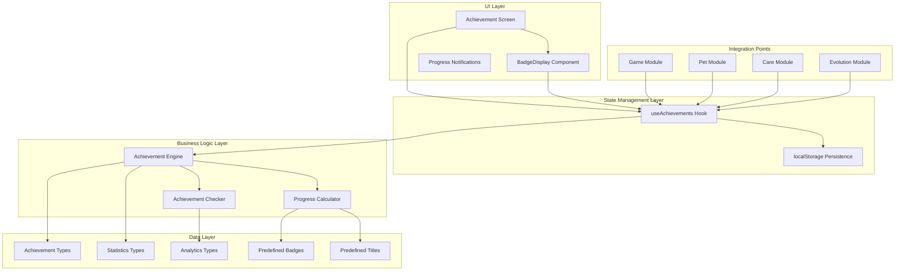
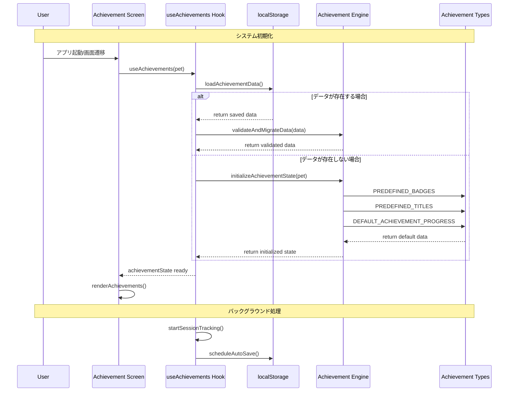
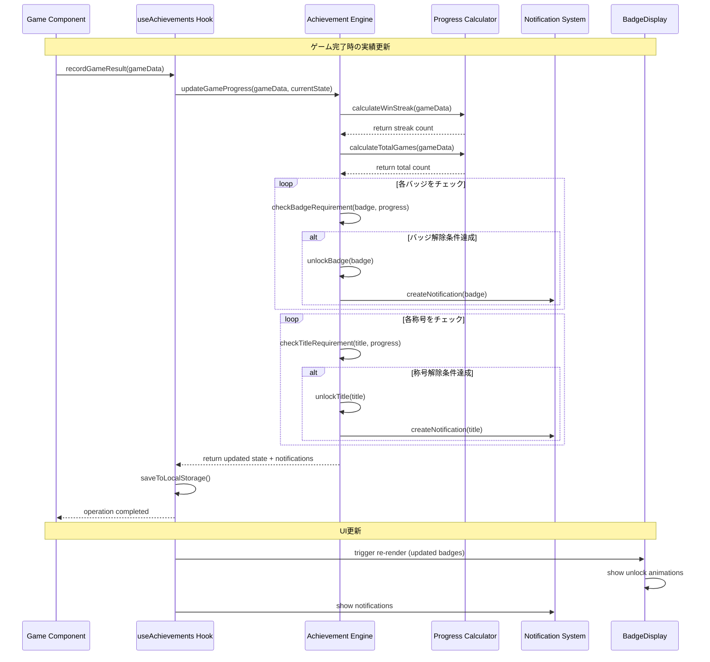
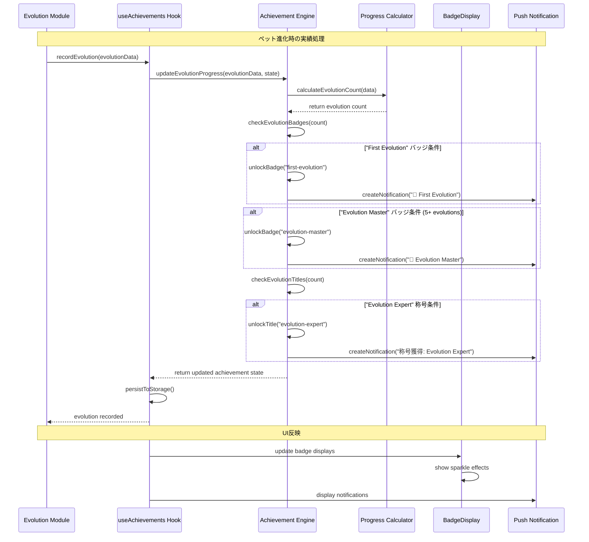
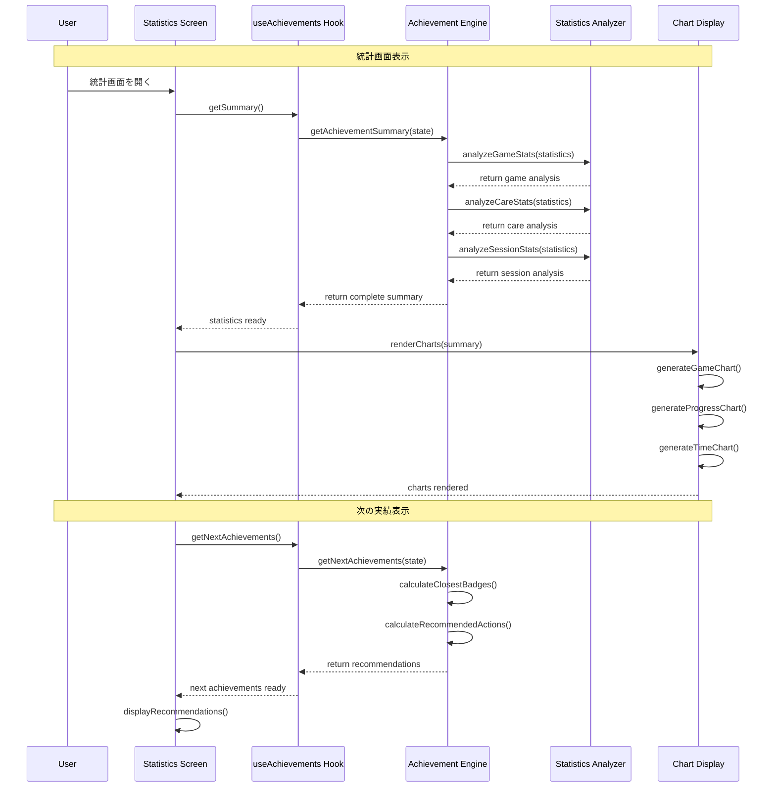
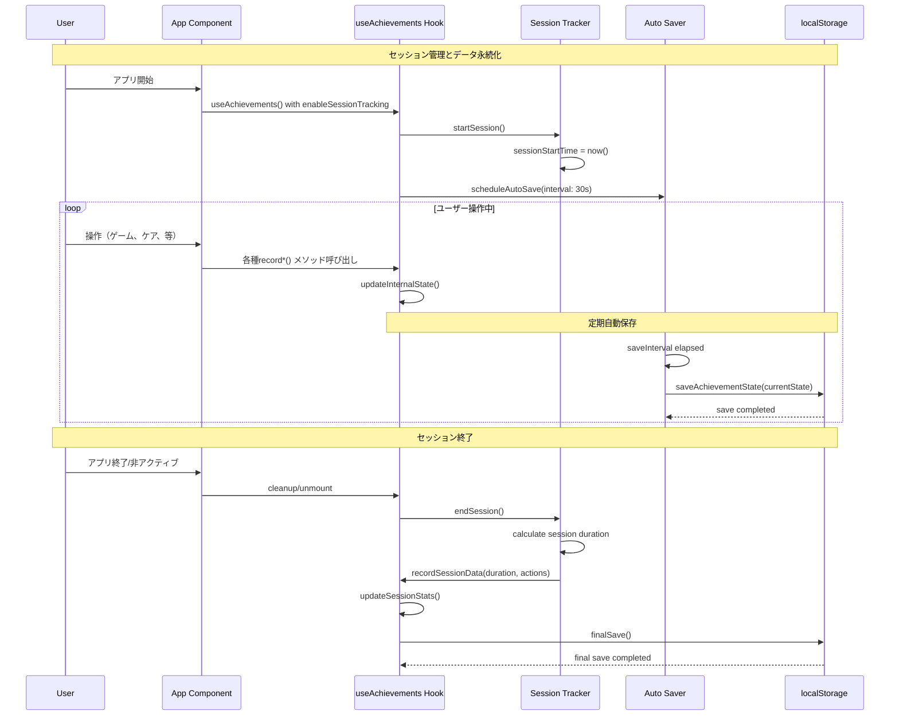
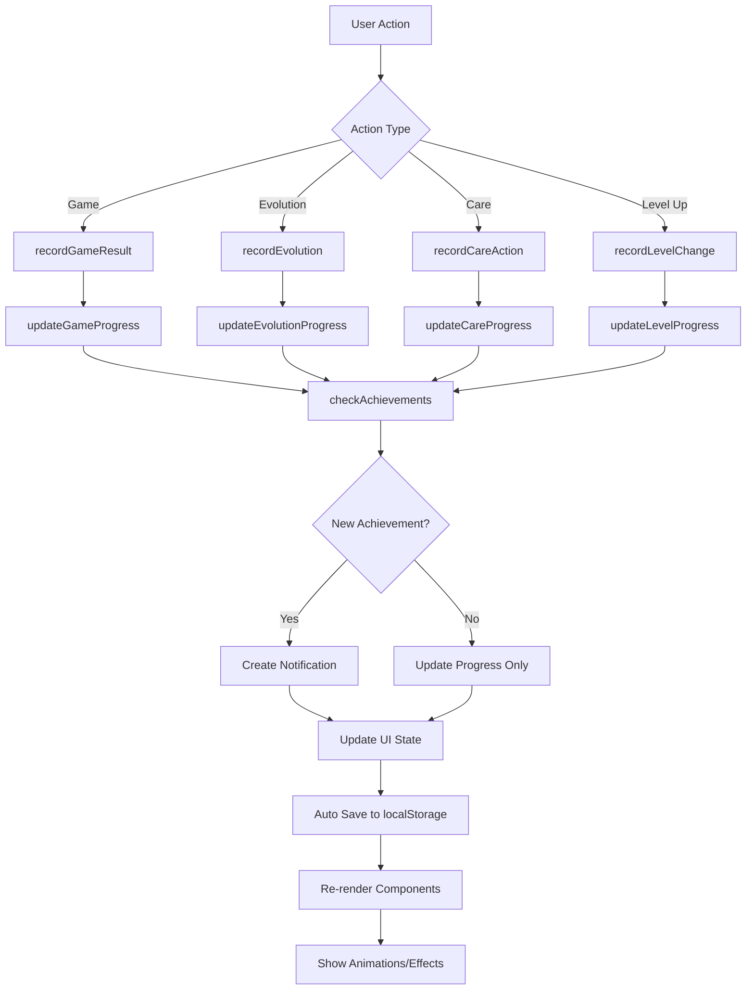

# AI Pet Buddy 実績・統計システム 技術仕様書

このドキュメントでは、AI Pet Buddyの実績・統計システム（Achievement & Statistics System）の技術仕様、アーキテクチャ、およびシーケンス図について詳細に説明します。

## 📋 目次

1. [システム概要](#システム概要)
2. [アーキテクチャ構成](#アーキテクチャ構成)
3. [シーケンス図](#シーケンス図)
4. [コンポーネント詳細](#コンポーネント詳細)
5. [データフロー](#データフロー)
6. [統合パターン](#統合パターン)
7. [API仕様](#api仕様)
8. [使用例](#使用例)

---

## システム概要

実績・統計システムは、AI Pet Buddyにゲーミフィケーション要素を追加し、ユーザーエンゲージメントの向上と明確な進捗目標を提供するシステムです。

### 🎯 主要機能

- **バッジシステム**: 9種類の事前定義されたバッジによる達成度追跡
- **称号システム**: 6種類の称号による熟練度表示
- **進捗管理**: リアルタイムでの進捗計算と通知
- **統計データ**: ゲーム履歴、ケア履歴、セッション統計の包括的な記録
- **通知システム**: 実績解除時の即座の通知と視覚効果
- **永続化**: localStorage基盤の自動保存機能

### 🏗️ システム構成

```
実績・統計システム
├── 型定義レイヤー (Types)
│   ├── Achievement.ts (57テスト)
│   ├── Statistics.ts (42テスト)
│   └── Analytics.ts (19テスト)
├── ビジネスロジックレイヤー (Utils)
│   └── achievementEngine.ts (33テスト)
├── 状態管理レイヤー (Hooks)
│   └── useAchievements.ts
└── 表示レイヤー (Components)
    ├── BadgeDisplay.tsx (39テスト)
    └── BadgeDisplay.css
```

---

## アーキテクチャ構成

### システムアーキテクチャ図



### 責任分散パターン

| レイヤー | 責任 | 主要コンポーネント |
|---------|------|------------------|
| **UI Layer** | 表示・ユーザーインタラクション | BadgeDisplay, Notifications |
| **State Management** | 状態管理・永続化 | useAchievements Hook |
| **Business Logic** | 実績チェック・進捗計算 | achievementEngine |
| **Data Layer** | 型定義・設定データ | Types, Predefined Data |

---

## シーケンス図

### 1. 実績システム初期化フロー



### 2. ゲーム結果による実績更新フロー



### 3. ペット進化による実績更新フロー



### 4. 統計データ分析・表示フロー



### 5. セッション追跡・自動保存フロー



---

## コンポーネント詳細

### 🎯 Achievement Engine (achievementEngine.ts)

実績システムの核となるビジネスロジックを提供します。

#### 主要機能
- **進捗計算**: ゲーム結果、ケア行動、進化、セッションデータに基づく進捗更新
- **実績チェック**: バッジ・称号の解除条件を自動チェック
- **通知生成**: 実績解除時の通知データ生成
- **データ検証**: 保存データの整合性チェックとマイグレーション

#### コアメソッド

```typescript
// 実績状態の初期化
export function initializeAchievementState(pet: Pet): AchievementState

// ゲーム結果による進捗更新
export function updateGameProgress(
  gameData: GameData, 
  currentState: AchievementState
): AchievementState

// 実績チェックと通知生成
export function checkAchievements(
  state: AchievementState, 
  progress: AchievementProgress
): AchievementNotification[]
```

### 🎣 useAchievements Hook

React状態管理と永続化を担当するカスタムフック。

#### 機能
- **状態管理**: 実績データの一元管理
- **自動保存**: configurable intervalでの自動保存
- **エラーハンドリング**: localStorage例外の処理
- **セッション追跡**: プレイ時間とアクション記録

#### Interface

```typescript
interface UseAchievementsReturn {
  // State
  achievementState: AchievementState;
  notifications: AchievementNotification[];
  isLoading: boolean;
  error: string | null;
  
  // Actions
  recordGameResult: (gameData: GameData) => void;
  recordEvolution: (evolutionData: EvolutionData) => void;
  recordCareAction: (careData: CareActionData) => void;
  activateTitle: (titleId: string) => void;
  dismissNotification: (notificationId: string) => void;
  
  // Queries
  getSummary: () => AchievementSummary;
  getNextAchievements: () => Badge[];
}
```

### 🏅 BadgeDisplay Component

個別バッジの表示を担当するReactコンポーネント。

#### 視覚特徴
- **レアリティベース**: Common(緑), Rare(青), Epic(紫), Legendary(金)
- **アニメーション**: 解除時のスパークル効果、シャイン効果
- **進捗表示**: 未解除バッジの進捗バー
- **レスポンシブ**: multiple size variants (small/medium/large)

#### Props Interface

```typescript
interface BadgeDisplayProps {
  badge: Badge;
  size?: 'small' | 'medium' | 'large';
  showProgress?: boolean;
  showDescription?: boolean;
  onClick?: (badge: Badge) => void;
  className?: string;
}
```

---

## データフロー

### 実績データの流れ



### 永続化データ構造

```json
{
  "ai-pet-buddy-achievements": {
    "badges": [
      {
        "id": "first-evolution",
        "unlocked": true,
        "unlockedAt": 1699123456789,
        "progress": 1.0
      }
    ],
    "titles": [
      {
        "id": "beginner-trainer", 
        "unlocked": true,
        "active": true,
        "unlockedAt": 1699123456789
      }
    ],
    "statistics": {
      "games": {
        "totalGames": 25,
        "wins": 18,
        "winStreak": 5,
        "maxWinStreak": 8
      },
      "care": {
        "totalActions": 45,
        "consecutiveDays": 7,
        "maxConsecutiveDays": 12
      }
    },
    "progress": {
      "evolutionCount": 3,
      "maxLevel": 15,
      "totalPlaytime": 7200000
    }
  }
}
```

---

## 統合パターン

### 既存システムとの統合

#### 1. ゲームシステム統合

```typescript
// MiniGamePanel.tsx での統合例
const MiniGamePanel = () => {
  const { recordGameResult } = useAchievements(pet);
  const { gameState, submitAnswer } = useGame();
  
  const handleGameComplete = (result: GameResult) => {
    // 既存のゲーム処理
    const gameSession = gameState.currentSession;
    
    // 実績システムに結果を記録
    recordGameResult({
      type: gameSession.type,
      result: result.outcome,
      timestamp: Date.now(),
      duration: result.duration
    });
  };
  
  return (
    // ゲームUI
  );
};
```

#### 2. ペットシステム統合

```typescript
// App.tsx での統合例
const App = () => {
  const [pet, setPet] = useState<Pet>(defaultPet);
  const { recordEvolution, recordCareAction } = useAchievements(pet);
  
  const handleEvolution = (newPet: Pet) => {
    setPet(newPet);
    
    // 実績システムに進化を記録
    recordEvolution({
      fromLevel: pet.level,
      toLevel: newPet.level,
      fromStage: pet.evolutionStage,
      toStage: newPet.evolutionStage,
      timestamp: Date.now()
    });
  };
  
  return (
    <div>
      <PetDisplay pet={pet} />
      <AchievementDisplay />
    </div>
  );
};
```

#### 3. 通知システム統合

```typescript
// 通知の表示統合
const AchievementNotifications = () => {
  const { notifications, dismissNotification } = useAchievements(pet);
  
  return (
    <div className="notifications">
      {notifications.map(notification => (
        <div key={notification.id} className="achievement-notification">
          <span>{notification.message}</span>
          <button onClick={() => dismissNotification(notification.id)}>
            ×
          </button>
        </div>
      ))}
    </div>
  );
};
```

---

## API仕様

### Types API

#### Achievement Types

```typescript
// バッジ定義
interface Badge {
  id: string;
  name: string;
  description: string;
  icon: string;
  category: AchievementCategory;
  rarity: AchievementRarity;
  requirements: AchievementRequirement;
  unlocked: boolean;
  unlockedAt?: number;
  progress: number; // 0-1
}

// 称号定義
interface Title {
  id: string;
  name: string;
  description: string;
  icon: string;
  category: AchievementCategory;
  rarity: AchievementRarity;
  requirements: AchievementRequirement;
  unlocked: boolean;
  unlockedAt?: number;
  active: boolean;
}

// 実績要求条件
interface AchievementRequirement {
  type: 'evolution_count' | 'game_win_streak' | 'consecutive_days' | 'level_reached' | 'stat_max' | 'total_games' | 'total_playtime';
  value: number;
  description: string;
}
```

#### Statistics Types

```typescript
// ゲーム統計
interface GameStatistics {
  totalGames: number;
  wins: number;
  losses: number;
  draws: number;
  winRate: number;
  winStreak: number;
  maxWinStreak: number;
  averageGameDuration: number;
  gameHistory: GameRecord[];
  gameTypeStats: GameTypeStatistics;
}

// ケア統計
interface CareStatistics {
  totalActions: number;
  feedingActions: number;
  playingActions: number;
  restingActions: number;
  consecutiveDays: number;
  maxConsecutiveDays: number;
  careHistory: CareRecord[];
  dailyCareStats: DailyCareStatistics;
}
```

### Engine API

#### Core Functions

```typescript
// 実績状態初期化
function initializeAchievementState(pet: Pet): AchievementState;

// 進捗更新関数群
function updateGameProgress(gameData: GameData, state: AchievementState): AchievementState;
function updateEvolutionProgress(evolutionData: EvolutionData, state: AchievementState): AchievementState;
function updateCareProgress(careData: CareActionData, state: AchievementState): AchievementState;
function updateLevelProgress(levelData: LevelData, state: AchievementState): AchievementState;

// 実績チェック
function checkAchievements(state: AchievementState, progress: AchievementProgress): AchievementNotification[];

// ユーティリティ関数
function activateTitle(titleId: string, state: AchievementState): AchievementState;
function getAchievementSummary(state: AchievementState): AchievementSummary;
function getNextAchievements(state: AchievementState): Badge[];
```

### Hook API

#### useAchievements Hook

```typescript
function useAchievements(
  pet: Pet, 
  options?: UseAchievementsOptions
): UseAchievementsReturn;

interface UseAchievementsOptions {
  autoSave?: boolean;           // デフォルト: true
  saveInterval?: number;        // デフォルト: 30000ms
  maxNotifications?: number;    // デフォルト: 5
  enableSessionTracking?: boolean; // デフォルト: true
}
```

---

## 使用例

### 基本的な使用例

```tsx
import { useAchievements } from './hooks/useAchievements';
import BadgeDisplay from './components/BadgeDisplay';

function AchievementScreen({ pet }: { pet: Pet }) {
  const {
    achievementState,
    notifications,
    recordGameResult,
    recordEvolution,
    getSummary,
    getNextAchievements
  } = useAchievements(pet);

  // ゲーム勝利時の処理
  const handleGameWin = () => {
    recordGameResult({
      type: 'rock-paper-scissors',
      result: 'win',
      timestamp: Date.now(),
      duration: 30
    });
  };

  // 進化時の処理
  const handleEvolution = () => {
    recordEvolution({
      fromLevel: pet.level,
      toLevel: pet.level + 1,
      fromStage: pet.evolutionStage,
      toStage: pet.evolutionStage + 1,
      timestamp: Date.now()
    });
  };

  const summary = getSummary();
  const nextAchievements = getNextAchievements();

  return (
    <div className="achievement-screen">
      <h1>実績一覧</h1>
      
      {/* バッジ表示 */}
      <div className="badges-grid">
        {achievementState.badges.map(badge => (
          <BadgeDisplay 
            key={badge.id} 
            badge={badge}
            size="medium"
            onClick={(badge) => showBadgeDetails(badge)}
          />
        ))}
      </div>

      {/* 統計サマリー */}
      <div className="summary">
        <h2>統計</h2>
        <p>総ゲーム数: {summary.totalGames}</p>
        <p>勝率: {(summary.winRate * 100).toFixed(1)}%</p>
        <p>解除済みバッジ: {summary.unlockedBadges}/{summary.totalBadges}</p>
      </div>

      {/* 次の実績 */}
      <div className="next-achievements">
        <h2>次の実績</h2>
        {nextAchievements.slice(0, 3).map(badge => (
          <BadgeDisplay 
            key={badge.id}
            badge={badge}
            size="small"
            showProgress={true}
          />
        ))}
      </div>

      {/* 通知 */}
      {notifications.map(notification => (
        <div key={notification.id} className="notification">
          {notification.message}
        </div>
      ))}
    </div>
  );
}
```

### 高度な統合例

```tsx
// ゲームコンポーネントでの統合
function RockPaperScissorsGame({ pet }: { pet: Pet }) {
  const [gameState, setGameState] = useState<GameState>('waiting');
  const { recordGameResult } = useAchievements(pet);
  
  const playGame = async (playerChoice: Choice) => {
    const startTime = Date.now();
    setGameState('playing');
    
    // ゲームロジック実行
    const result = await executeGame(playerChoice);
    const duration = (Date.now() - startTime) / 1000;
    
    // 結果をゲーム状態に反映
    setGameState('finished');
    
    // 実績システムに記録
    recordGameResult({
      type: 'rock-paper-scissors',
      result: result.outcome,
      timestamp: startTime,
      duration: duration
    });
  };

  return (
    <div className="rps-game">
      {/* ゲームUI */}
    </div>
  );
}

// 統計ダッシュボードでの使用
function StatisticsDashboard({ pet }: { pet: Pet }) {
  const { getSummary, achievementState } = useAchievements(pet);
  const summary = getSummary();
  
  return (
    <div className="stats-dashboard">
      <div className="charts">
        <Chart 
          type="doughnut"
          data={{
            labels: ['勝利', '敗北', '引き分け'],
            datasets: [{
              data: [summary.wins, summary.losses, summary.draws],
              backgroundColor: ['#10b981', '#ef4444', '#6b7280']
            }]
          }}
        />
      </div>
      
      <div className="progress-overview">
        {achievementState.badges.map(badge => (
          <div key={badge.id} className="progress-item">
            <span>{badge.name}</span>
            <div className="progress-bar">
              <div 
                className="progress-fill"
                style={{ width: `${badge.progress * 100}%` }}
              />
            </div>
            <span>{(badge.progress * 100).toFixed(0)}%</span>
          </div>
        ))}
      </div>
    </div>
  );
}
```

---

## 🧪 テスト仕様

### テスト構成

- **型定義テスト**: 118テスト (Achievement: 57, Statistics: 42, Analytics: 19)
- **エンジンテスト**: 33テスト (achievementEngine.ts)
- **コンポーネントテスト**: 39テスト (BadgeDisplay.tsx)
- **合計**: 190テスト

### 主要テストケース

#### 実績エンジンテスト
- 初期化処理の検証
- 各種進捗更新の検証
- バッジ・称号解除条件の検証
- 通知生成の検証
- エラーハンドリングの検証

#### バッジ表示テスト
- 各レアリティの表示検証
- 進捗表示の検証
- アニメーション効果の検証
- アクセシビリティの検証
- レスポンシブデザインの検証

---

## 🚀 パフォーマンス最適化

### 計算効率化
- 進捗計算のメモ化
- 不要な実績チェックのスキップ
- バッチ更新による描画最適化

### メモリ管理
- 通知履歴の自動削除
- 統計データの圧縮保存
- 未使用データの定期クリーンアップ

### 永続化最適化
- 差分更新による保存量削減
- 自動保存間隔の調整
- エラー回復機能

---

## 📈 今後の拡張予定

### Phase 5以降の機能拡張
- Chart.jsによる詳細統計ダッシュボード
- データエクスポート機能
- ソーシャル機能（実績共有）
- アドバンスド分析機能
- 季節限定実績システム

### 技術的改善項目
- WebWorkerによるバックグラウンド処理
- IndexedDBへの移行検討
- リアルタイム同期機能
- PWA統合によるオフライン対応

---

*このドキュメントは AI Pet Buddy Phase 4 実装 (2024年) に基づいて作成されました。*
*最新情報については、プロジェクトリポジトリをご確認ください。*