# 実績・統計システム シーケンス図詳細版

このドキュメントでは、AI Pet Buddy実績・統計システムの詳細なシーケンス図とフローチャートを提供します。

## 📋 目次

1. [システム全体フロー](#システム全体フロー)
2. [詳細シーケンス図](#詳細シーケンス図)
3. [エラーハンドリングフロー](#エラーハンドリングフロー)
4. [データフローダイアグラム](#データフローダイアグラム)
5. [状態遷移図](#状態遷移図)

---

## システム全体フロー

### 実績システム全体アーキテクチャ

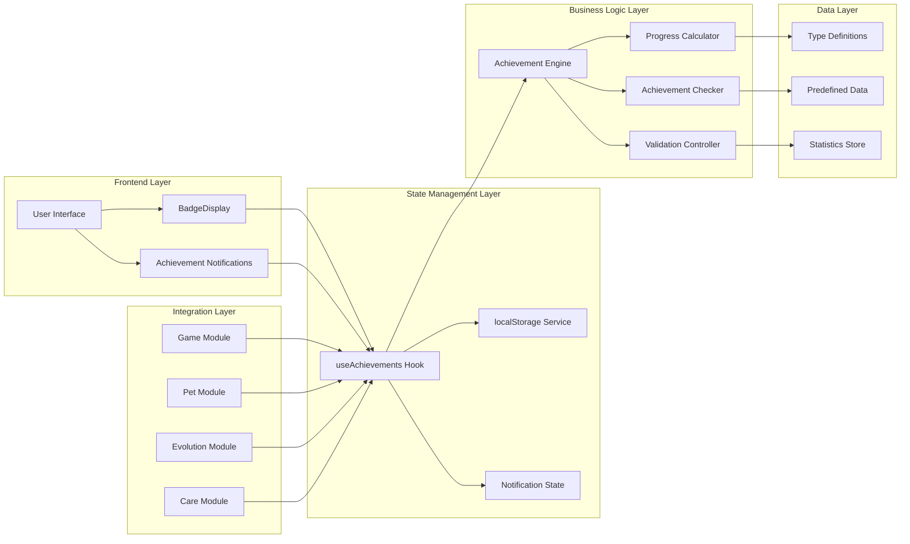

---

## 詳細シーケンス図

### 1. システム起動・初期化の詳細フロー

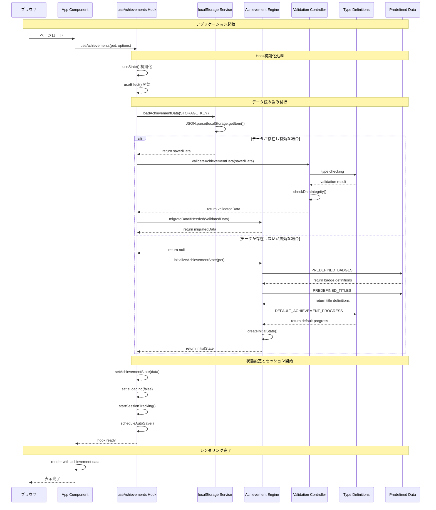

### 2. ゲーム結果記録の詳細フロー

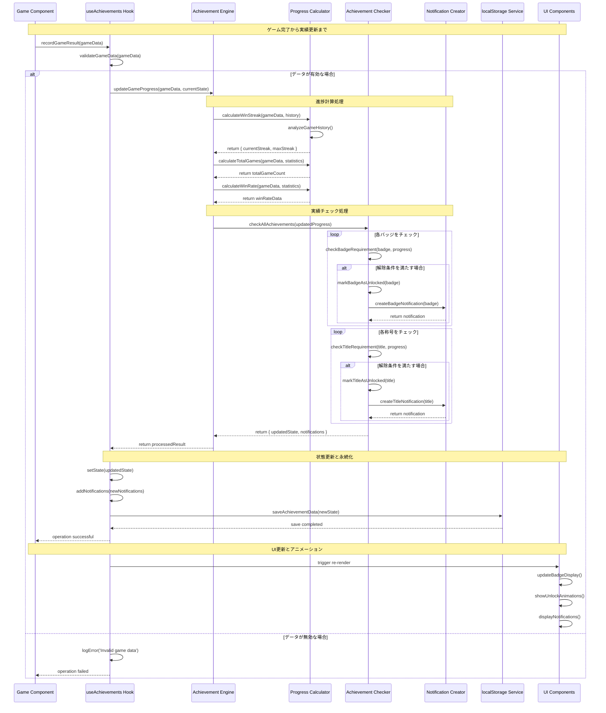

### 3. 進化記録の詳細フロー

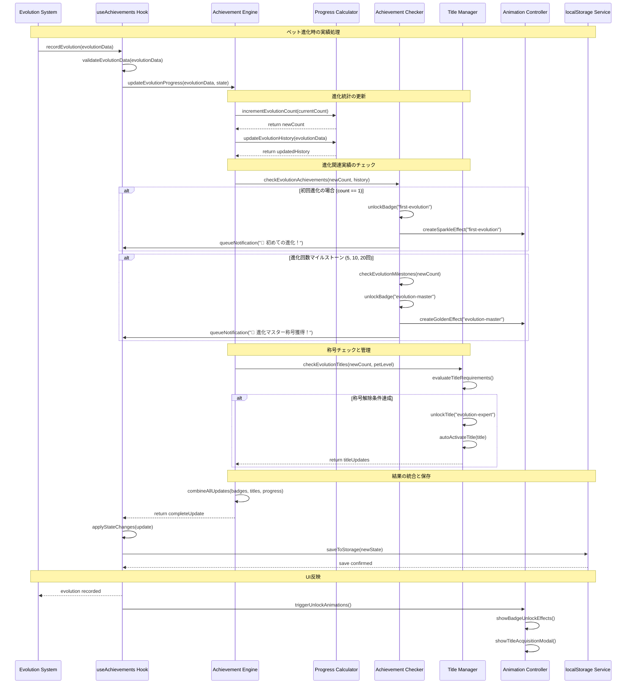

### 4. セッション管理の詳細フロー

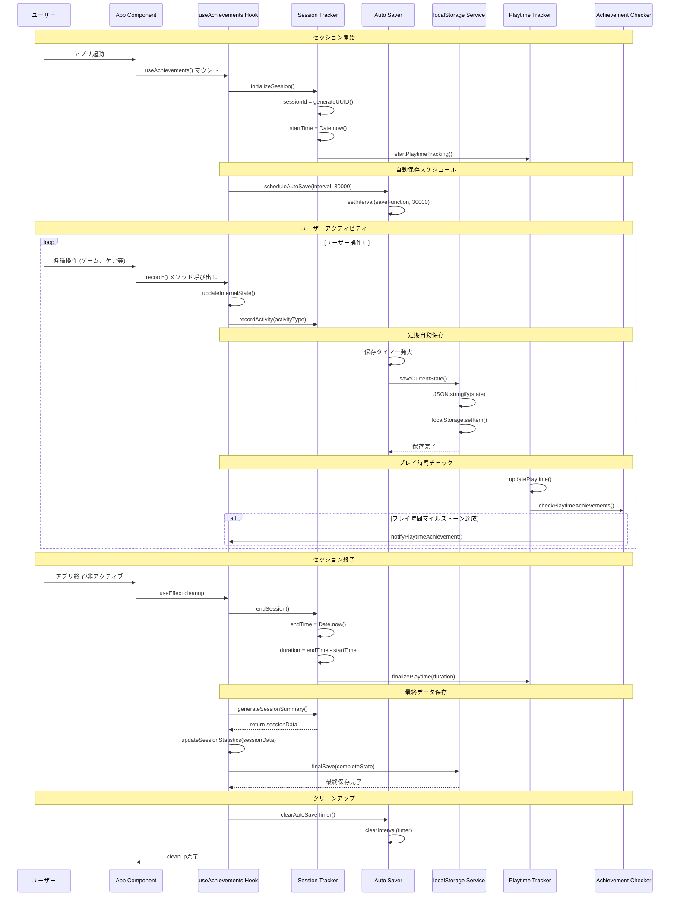

---

## エラーハンドリングフロー

### localStorage エラーハンドリング

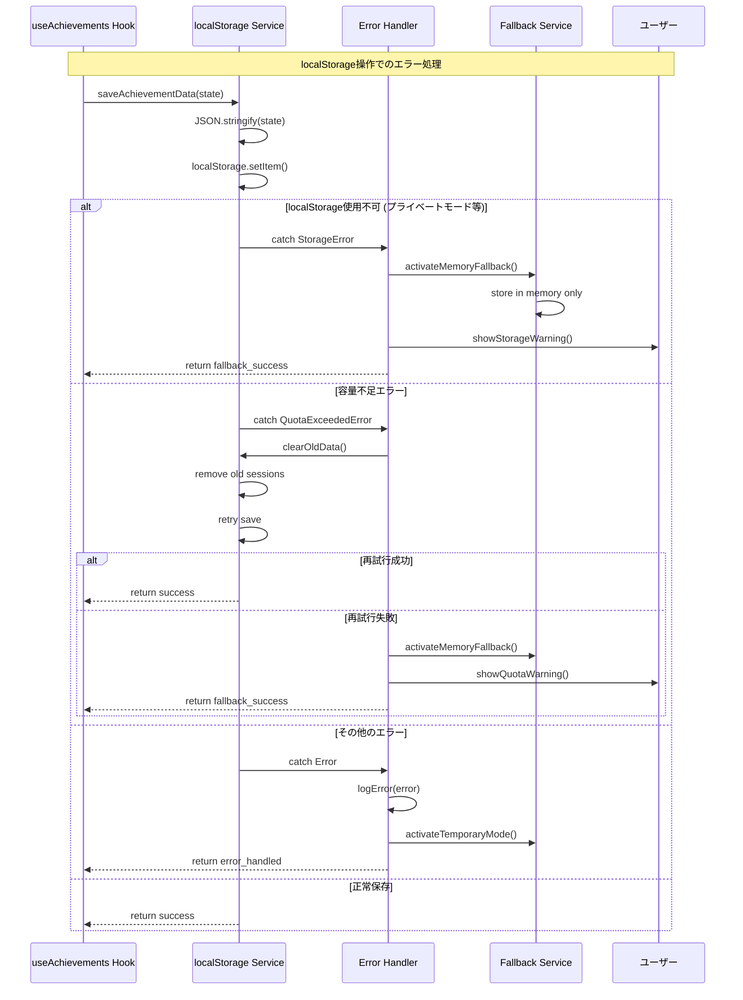

### データ整合性チェックフロー

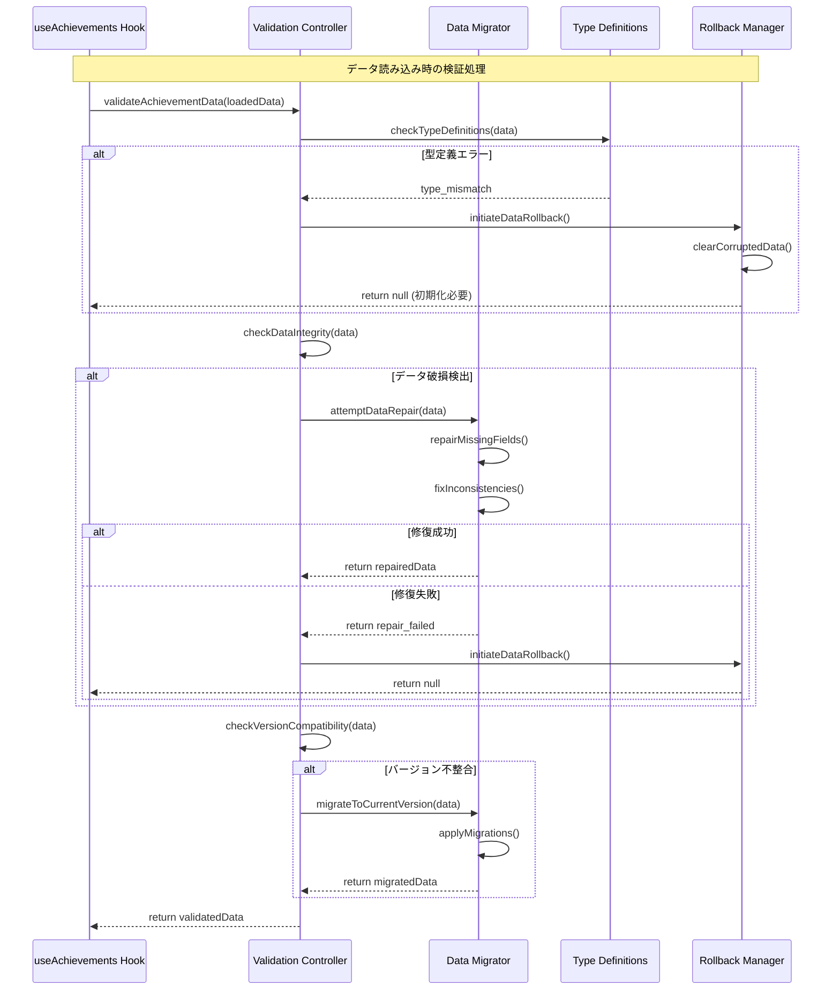

---

## データフローダイアグラム

### 実績データの変換フロー

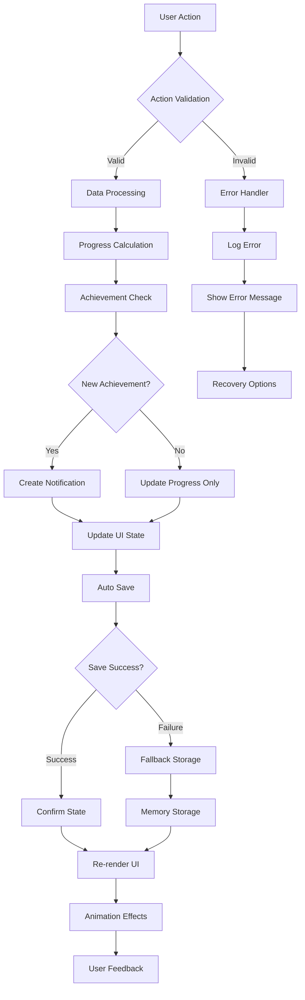

### 統計データ集計フロー

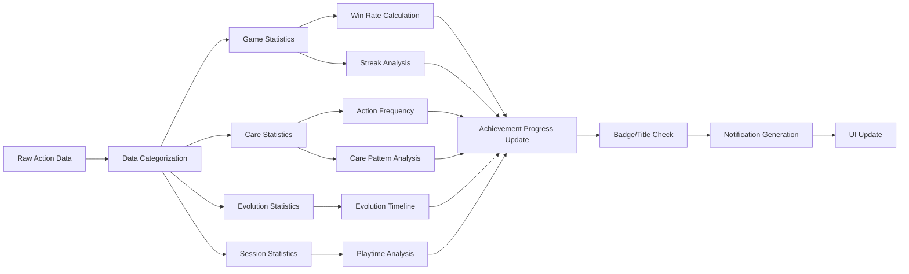

---

## 状態遷移図

### バッジ状態の遷移

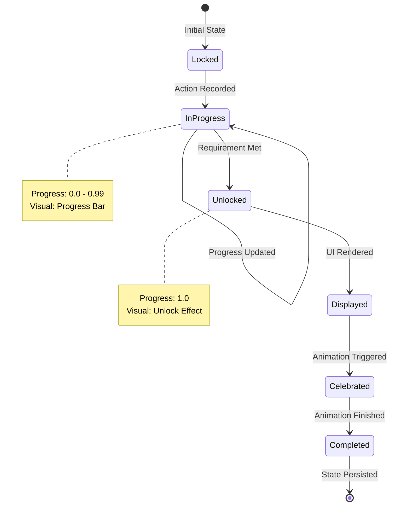

### 称号状態の遷移

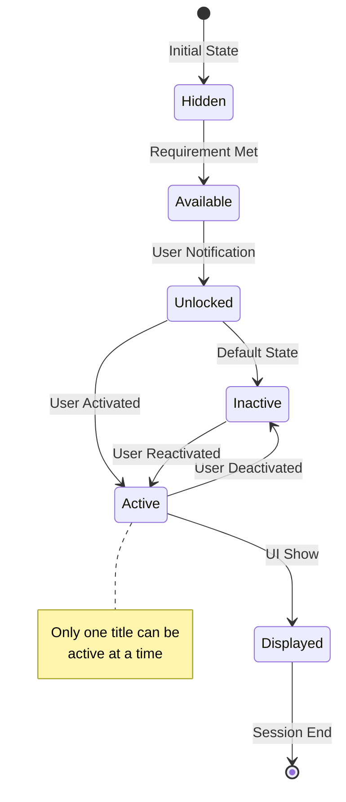

### セッション状態の遷移

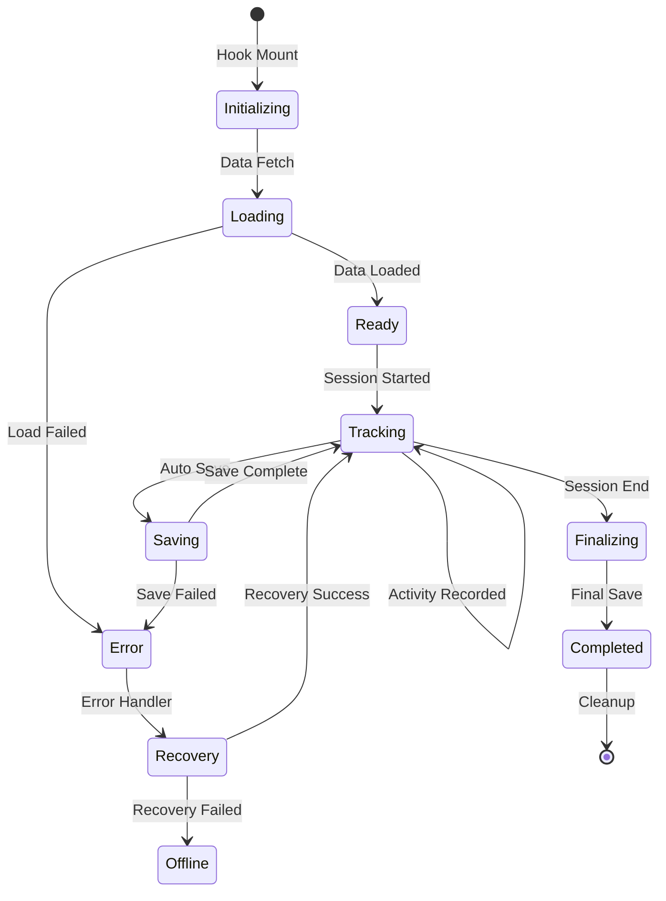

---

## パフォーマンス最適化フロー

### メモ化による計算最適化

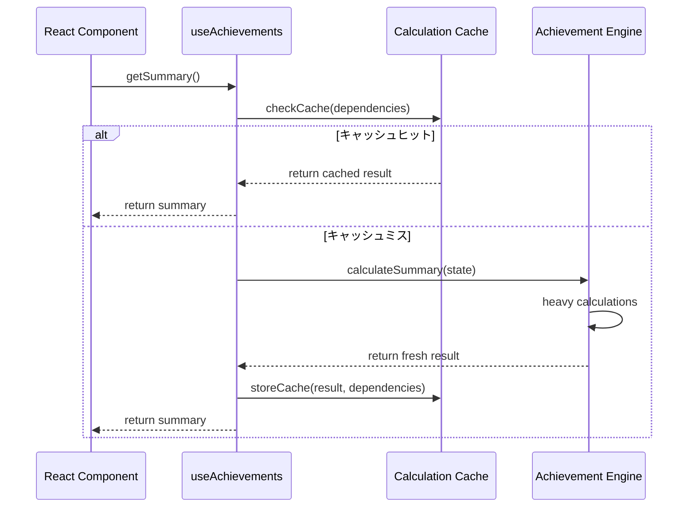

### バッチ更新による描画最適化

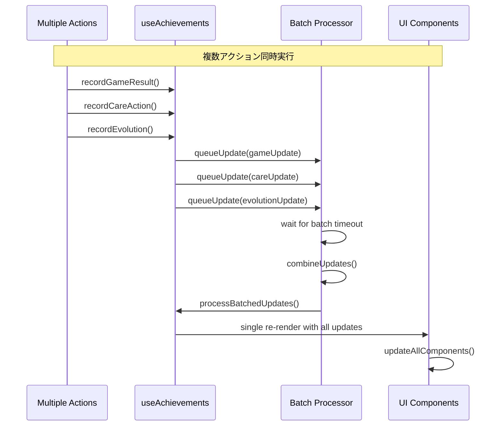

---

*このドキュメントは AI Pet Buddy Phase 4 実装の詳細シーケンス図仕様書です。*
*システムの動作フローを正確に理解するための技術資料として活用してください。*