# AI Pet Buddy シェア機能 アーキテクチャ図

このドキュメントでは、シェア機能のアーキテクチャを視覚的に表現した図とフローチャートを提供します。

## 🏗️ システムアーキテクチャ概要図

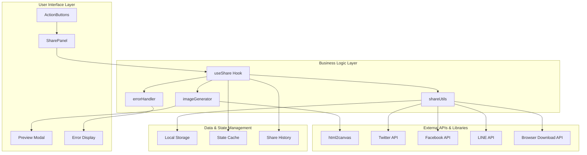

## 📊 データフロー図

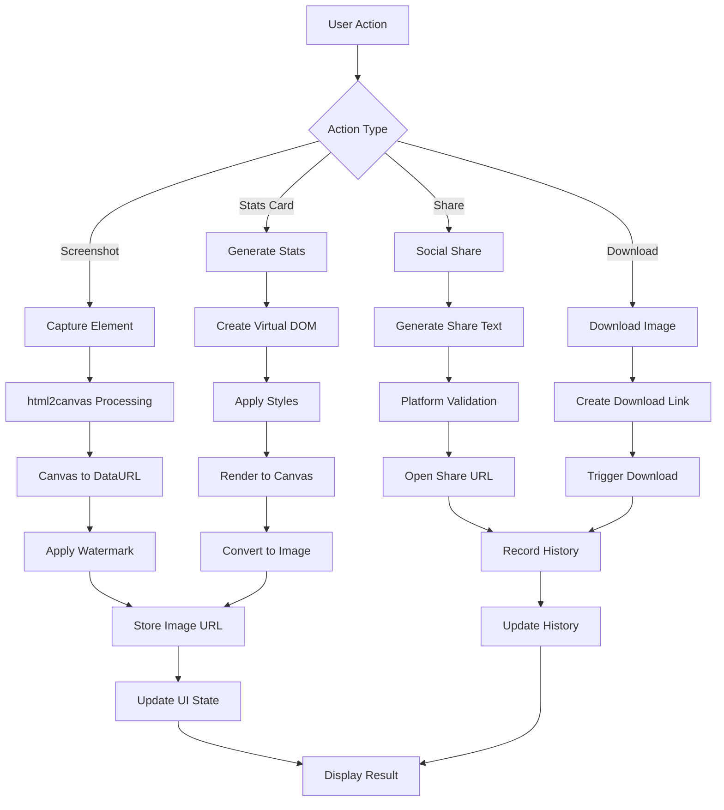

## 🔄 コンポーネント相互作用図

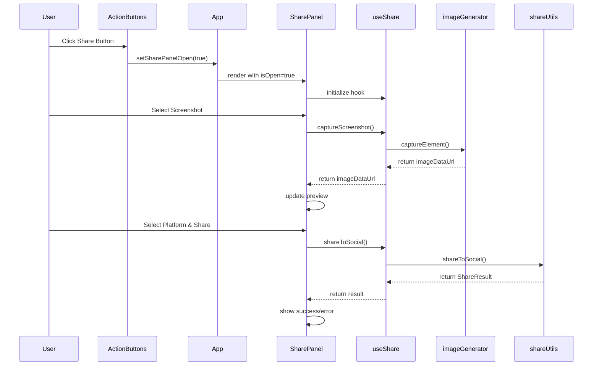

## 🗂️ ファイル構成・モジュール図

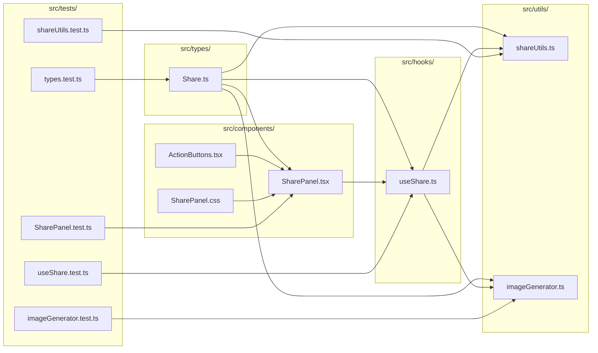

## ⚙️ 機能別フローチャート

### スクリーンショット生成フロー

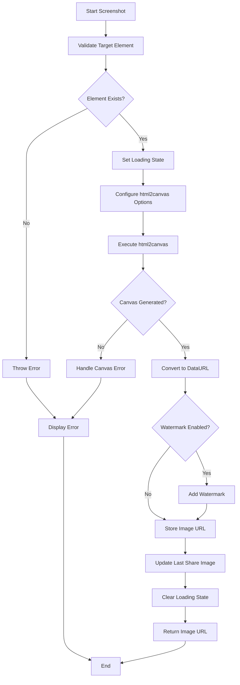

### SNSシェア実行フロー

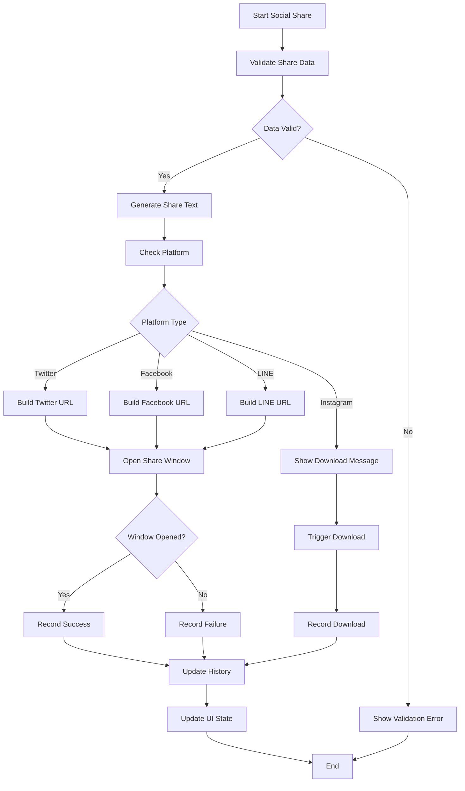

### 統計カード生成フロー

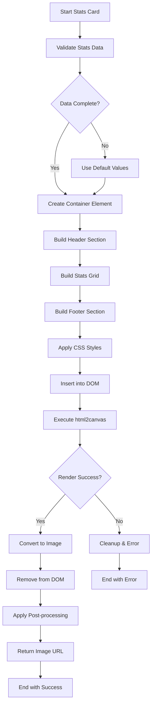

## 🧩 状態管理図

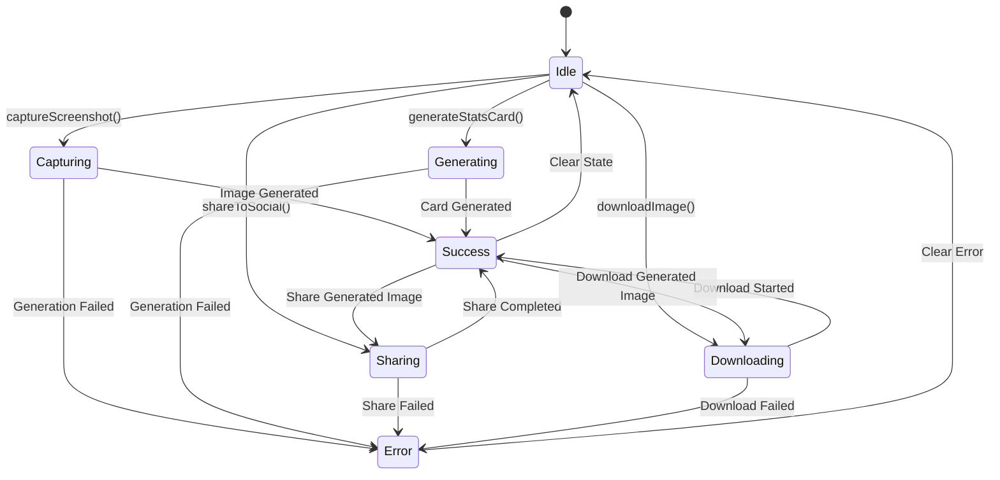

## 🎯 エラーハンドリングフロー

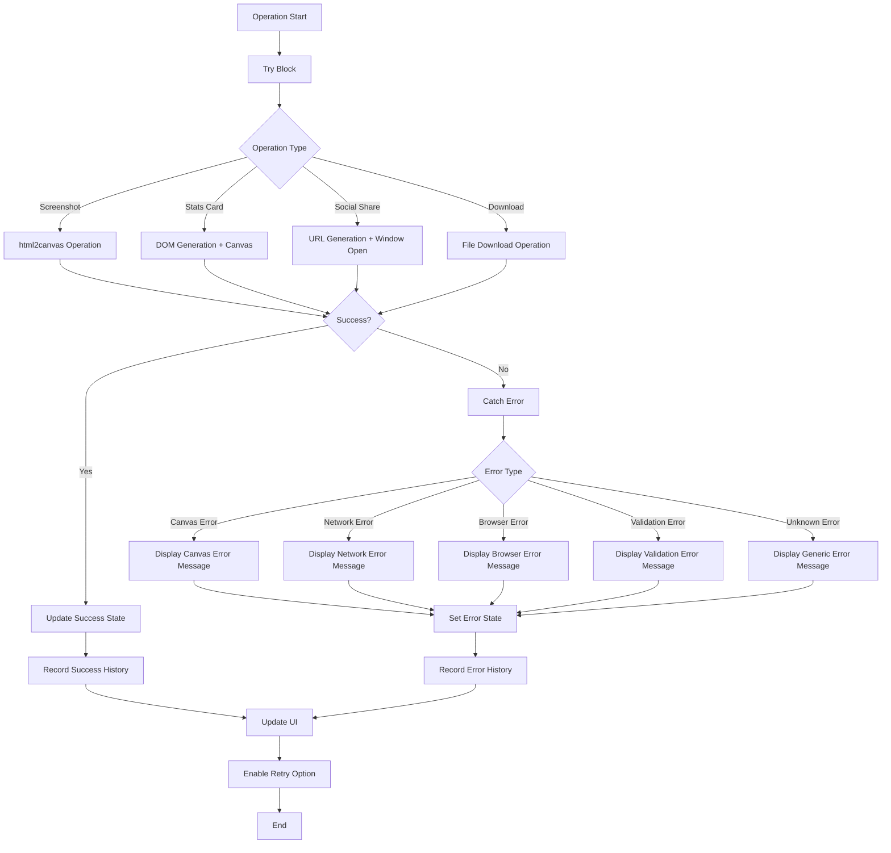

## 📱 レスポンシブ対応図

```mermaid
graph TB
    subgraph "Desktop (1200px+)"
        D1[Full SharePanel Modal]
        D2[Large Preview Images]
        D3[Horizontal Button Layout]
        D4[Detailed Error Messages]
    end
    
    subgraph "Tablet (768px - 1199px)"
        T1[Compact SharePanel]
        T2[Medium Preview Images]
        T3[Grid Button Layout]
        T4[Abbreviated Messages]
    end
    
    subgraph "Mobile (< 768px)"
        M1[Bottom Sheet Panel]
        M2[Small Preview Images]
        M3[Vertical Button Stack]
        M4[Icon-based Messages]
    end
    
    subgraph "Shared Components"
        SC1[useShare Hook Logic]
        SC2[Error Handling]
        SC3[Image Generation]
        SC4[Share Functionality]
    end
    
    D1 --> SC1
    T1 --> SC1
    M1 --> SC1
    
    D2 --> SC3
    T2 --> SC3
    M2 --> SC3
    
    D4 --> SC2
    T4 --> SC2
    M4 --> SC2
```

## 🔧 テスト構造図

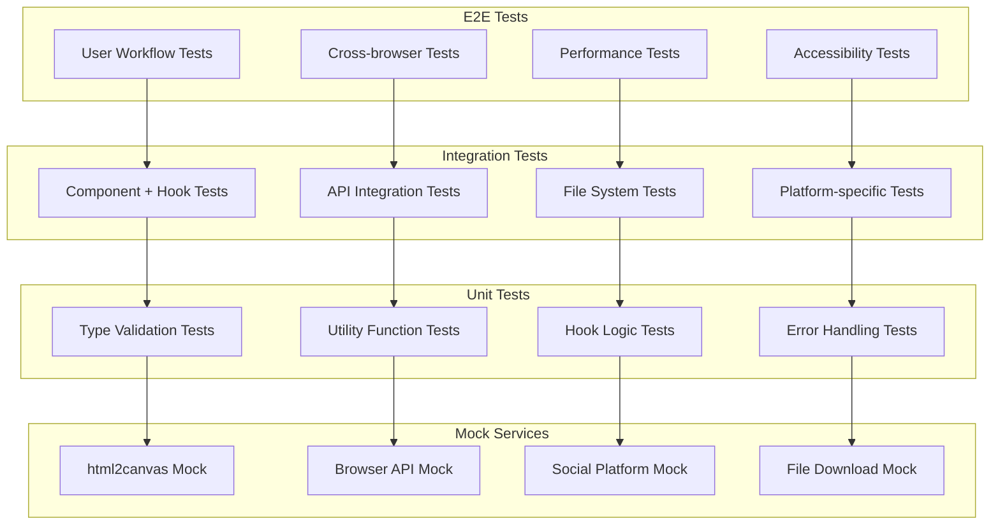

## 📊 パフォーマンス監視図

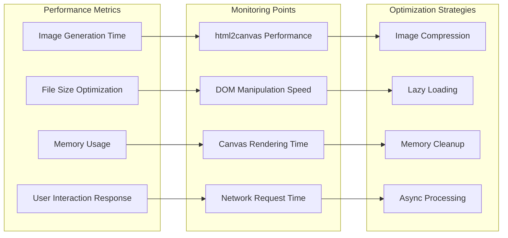

---

これらの図により、AI Pet Buddyシェア機能の全体像と詳細な実装構造が明確になり、開発・保守・拡張作業の効率化が期待されます。各図は相互に関連しており、システムの理解を多角的にサポートします。